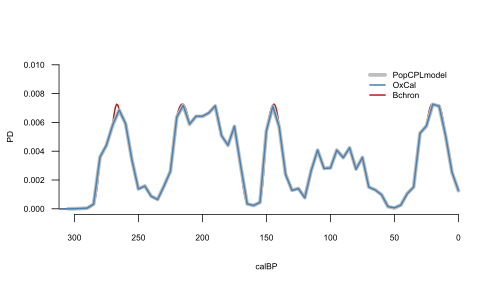

This vignette provides a comprehensive guide to modelling population dynamics using the R package ADMUR, and accompanies the publication 'Directly modelling population dynamics in the South American Arid Diagonal using 14C dates', Philosophical Transactions B, 2020, A. Timpson et al. It assumes the user has some basic familiarity with programming in R. 

In addition to some basic information on getting started, this vignette is divided into three main parts:

1. **Date calibration and SPDs:**  Calibrate individual radiocarbon dates, generate Summed Probability Distributions, and automatically phase large datasets to adjust for ascertainment bias. Comparison with other software.
1. **Continuous Piecewise Linear (CPL) Modelling:** Parameter estimation using the likelihood function, and its application in MCMC for estimating credible intervals. Model selection using BIC, and the goodness-of-fit (GOF) test.
1. **SPD simulation testing:** Null hypothesis testing by simulating SPDs and comparing to the observed SPD. P-values generated using likelihoods, rather than summary statistics originally devised in Shennan et al 2013 and Timpson et al 2014.

## Installation

The ADMUR package can be installed directly from GitHub, after installing and loading the 'devtools' package on the CRAN:

```{r, eval = FALSE}
install.packages('devtools')
library(devtools)
install_github('UCL/ADMUR')
```

The ADMUR package can then be locally loaded:

```{r, message = FALSE}
library(ADMUR)
```

## 14C datasets

A summary of the available help files and data sets included in the package can be browsed, which include a terrestrial anthropogenic 14C dataset from the South American Arid Diagonal:

```{r, eval = FALSE}
help(ADMUR)
help(arid)
```

Datasets must be structured as a data frame that include columns 'age' and 'sd', which represent the uncalibrated 14C age and its error, respectively.


```{r, eval = TRUE}
arid[1:5,1:8]
```
**********
# Part 1
# Date calibration and SPDs

The algorithm used by ADMUR to calculate model likelihoods of a 14C dataset uses several functions to first calibrate 14C dates. These functions are also intrinsically useful for ordinary date calibration or for generating a Summed Probability Distribution (SPD).

## Calibrated 14C date probability distributions

Generating a single calibrated date distribution or SPD requires either a two-step process to give the user full control of the date range and temporal resolution, or a simpler one step process using a wrapper function that automatically estimates a sensible date range and resolution from the dataset, performs the two step process internally, and plots the SPD.

### With the wrapper

1. Use the function [summedCalibratorWrapper()](../html/summedCalibratorWrapper.html) 

```{r, eval = TRUE, fig.height = 4, fig.width=7, fig.align = "center", dev='svg', warning=FALSE}
data <- data.frame( age = c(6562,7144),  sd = c(44,51)  )
x <- summedCalibratorWrapper(data)
```

Notice the function automatically assumed the data provided were all 14C dates. However, if you have other kinds of date such as thermoluminescence you can specify 'nonC14'. You can also specify a particular calibration curve:

```{r, eval = TRUE, fig.height = 4, fig.width=7, fig.align = "center", dev='svg', warning=FALSE}
data <- data.frame( age = c(6562,7144),  sd = c(44,51), datingType = c('C14','nonC14') )
x <- summedCalibratorWrapper(data, shcal13)
```

### Without the wrapper

Generating the SPD without the wrapper gives you more control, and requires a two step process:

1. Convert a calibration curve to a CalArray using the function [makeCalArray()](../html/makeCalArray.html)
1. Calibrate the 14C dates through the CalArray using the function [summedCalibrator()](../html/summedCalibrator.html).

```{r, eval = TRUE, fig.height = 4, fig.width=7, fig.align = "center", dev='svg', warning=FALSE}
data <- data.frame(age = c(9144), sd=c(151) )
CalArray <- makeCalArray( intcal13, calrange = c(8000,13000) )
cal <- summedCalibrator(data, CalArray)
plotPD(cal)
```

The CalArray is essentially a two-dimensional probability array of the calibration curve, and can be viewed using the [plotCalArray()](../html/plotCalArray.html) function. Although the calibration curve has a maximum temporal resolution of 5 cal yrs, a finer resolution CalArray can be generated using the parameter **inc** which interpolates the calibration curve. However, this can be time costly if plotting the entire 50,000 year range of the calibration curve. 

```{r, eval = TRUE, fig.height = 5, fig.width=5, fig.align = "center", dev='jpeg'}
x <- makeCalArray(shcal13, c(5500,6000), inc=1 )
plotCalArray(x)
```


## Calibration comparison with other software

It is worth noting that the algorithm used by this package to calibrate 14C dates gives equivalent results to those from [OxCal](https://c14.arch.ox.ac.uk/oxcal.html) generated using [OxcAAR](https://cran.r-project.org/web/packages/oxcAAR/index.html) but these differ slightly to the results generated by [Bchron](https://cran.r-project.org/web/packages/Bchron/index.html).



## Phased data: adjusting for ascertainment bias

A naive approach to generating an SPD as a proxy for population dynamics would be to sum all dates in the dataset, but a more sensible approach is to sum the SPDs of each phase. The need to bin dates into phases is an important step in modelling population dynamics to adjust for the data ascertainment bias of some archaeological finds having more dates by virtue of a larger research interest or budget. 

Therefore [phaseCalibrator()](../html/phaseCalibrator.html) generates an SPD for each phase in a dataset, and includes a binning algorithm which provides a useful solution to handling large datasets that have not been phased. For example, consider the following 8 dates from 2 sites:

```{r, eval = TRUE}
data <- subset(arid, site %in% c('Carrizal','Pacopampa'))
data[,2:7]
```

The data have not been binned (do not include a column 'phase') therefore the default binning algorithm calibrates these dates into 4 phases:


```{r, eval = TRUE, fig.height = 4, fig.width=7, fig.align = "center", dev='svg', warning=FALSE}
CalArray <- makeCalArray(shcal13, calrange = c(2000,6000))
x <- phaseCalibrator(data, CalArray)
plotPD(x)
```

Finally, the distributions in each phase can be summed and normalised to unity. It is straight forward to achieve this directly from the dataframe created above: 

```{r, eval = TRUE}
SPD <- as.data.frame(rowSums(x))

# normalise
SPD <- SPD/(sum(SPD)*CalArray$inc)
```

Alternatively, the wrapper function [summedPhaseCalibrator()](../html/summedPhaseCalibrator.html) will perform this entire workflow internally:

```{r, eval = TRUE, fig.height = 4, fig.width=7, fig.align = "center", dev='svg', warning=FALSE}
SPD <- summedPhaseCalibrator(data, shcal13, c(2000,6000))
plotPD(SPD)
```

**********
# Part 2
# Continuous Piecewise Linear (CPL) Modelling

A CPL model lends itself well to the objectives of identifying specific demographic events. Its parameters are the (x,y) coordinates of the hinge points, which are the relative population size (y) and timing (x) of these events. Crucially, this package calculates model likelihoods (the probability of the data given some proposed parameter combination). This likelihood is used in a search algorithm to find the maximum likelihood parameters; to compare models with different numbers parameters to find the best fit without overfitting; in Monte-Carlo Markov Chain (MCMC) analysis to estimate credible intervals of those parameters; and in a goodness-of-fit test to check that the data is a typical realisation of the maximum likelihood model and its parameters.

## Calculating likelihoods

Theoretically a calibrated date should be a continuous Probability Density Function (PDF), however in practice a date is represented as a discrete vector of probabilities corresponding to each calendar year, and therefore is a Probability Mass Function (PMF). Because calibration curves have a resolution of 5 years at best, this package generates a calibrated PMF with a default resolution of 5 years, although this can be adjusted to any preferred resolution (see [makeCalArray()](../html/makeCalArray.html) ). This discretisation provides the advantage that numerical methods can be used to easily calculate likelihoods, provided the model is also discretised. 

A [toy()](../html/toy.html) model and population is provided to demonstrate how this achieved. Notice the toy population covers a slightly wider date range to ensure simulated 14C dates are well represented around the edges. First, we simulate a plausible 14C dataset and calibrate it:

```{r, eval = TRUE}
# Generate some simulated archaeological samples in proportion to the toy population dynamics
pop.years <- as.numeric(row.names(toy$population))
mod.years <- as.numeric(row.names(toy$model))
cal <- sample(x = pop.years, size = 99, replace = TRUE, prob = toy$population$individuals ) 

# Convert to 14C dates. 14C errors are borrowed from the real dataset 'arid'.
age <- uncalibrateCalendarDates(cal, shcal13)
sd <- sample(x = arid$sd, size = 99, replace = TRUE)
data <- data.frame(age = age, sd = sd, phase = 1:99, datingType = 'C14')

# Calibrate each phase, taking care to restrict to the modelled date range
CalArray <- makeCalArray(shcal13, calrange = range(mod.years), inc = 1)
PD <- phaseCalibrator(data, CalArray)
```

Next we remove any calibrated dates with less than 50% of their PD within the modelled date range. This is a crucial step to avoid mischievous edge effects of dates outside the date range. The logic of only including dates with at least 50% of their PD within the date range is that their true dates are more likely to be within the date range (internal) than external:

```{r, eval = TRUE}
i <- colSums(PD) >= (0.5 / CalArray$inc) 
PD <- PD[,i] 
```

Finally we calculate the overall log likelihood of the model given the data:

```{r, eval = TRUE}
loglik(PD, toy$model)
```

For comparison, we can calculate the overall likelihood of a uniform model given exactly the same data. Intuitively this should have a lower likelihood, since our dataset was randomly generated from a toy population history that came from the toy model:

```{r, eval = TRUE}
uniform.model <- toy$model
uniform.model$pdf <- 1/nrow(uniform.model)
loglik(PD, uniform.model)
```

## Searching for maximum likelihood CPL model

Having established how to calculate the likelihood of any proposed model given a dataset, we can use any out-of-the-box search algorithm to find the maximum likelihood model. Crucially this requires us to ... parameters to .... a model pdf.


**********
# Part 3
# SPD simulation testing

Quote some text from paper about why this isnt a very sophisticated approach. Explain key improvement that the summary statistic is the likelihood.
