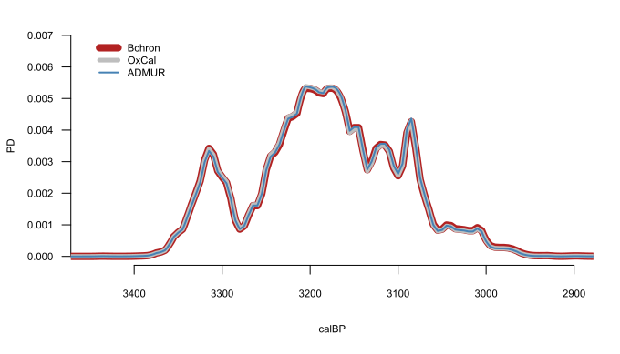

<style>
p.caption {font-size: 0.7em;}
</style>

**********

# 1. Overview

## Introduction to ADMUR

This vignette provides a comprehensive guide to modelling population dynamics using the R package ADMUR, and accompanies the publication 'Directly modelling population dynamics in the South American Arid Diagonal using 14C dates', Philosophical Transactions B, 2020, A. Timpson et al. https://doi.org/10.1098/rstb.2019.0723 

Throughout this vignette, R code blocks often use objects created earlier in the vignette in previous code blocks. However, the manual for each function provides examples with self sufficient R code blocks.

The motivation for creating the ADMUR package is to provide a robust framework to infer population dynamics from radiocarbon datasets, given the uncontroversial assumption that (to a first order of approximation) the archaeological record contains more dateable anthropogenic material from prehistoric periods when population levels were greater.
Unfortunately, the spatiotemporal sparsity of radiocarbon data conspires with the wiggly nature of the calibration curve to encourage the overinterpretation of such datasets, often leading to colourful but statistically unjustified interpretations of population dynamics.
No statistical method can (or ever will) be able to perfectly reconstruct the true population dynamics from such a dataset. ADMUR is no exception to this, but provides tools to infer a plausible yet conservative reconstruction of population dynamics. 

**NOTE: The ADMUR package is still under construction and the paper is in press. Both are due for publication on 30th November 2020**

## Installation

The ADMUR pacakge can be installed directly from the CRAN in the usual way:
```{r, eval = FALSE}
install.packages('ADMUR')
```

Alternatively it can be installed from GitHub, after installing and loading the 'devtools' package on the CRAN:
```{r, eval = FALSE}
install.packages('devtools')
library(devtools)
install_github('UCL/ADMUR')
```

Either way, the ADMUR package can then be locally loaded:
```{r, message = FALSE}
library(ADMUR)
```

## 14C datasets

A summary of the available help files and data sets included in the package can be browsed, which include a terrestrial anthropogenic ^14^C dataset from the South American Arid Diagonal:
```{r, eval = FALSE}
help(ADMUR)
help(SAAD)
```

Datasets must be structured as a data frame that include columns 'age' and 'sd', which represent the uncalibrated ^14^C age and its error, respectively.
```{r, eval = TRUE}
SAAD[1:5,1:8]
```

## Citations

Citations are available as follows:
```{r, eval = TRUE}
citation('ADMUR')
```
**********

# 2. Date calibration and SPDs

The algorithm used by ADMUR to calculate model likelihoods of a ^14^C dataset uses several functions to first calibrate ^14^C dates. These functions are also intrinsically useful for ^14^C date calibration or for generating a Summed Probability Distribution (SPD).

## Calibrated ^14^C date probability distributions

Generating a single calibrated date distribution or SPD requires either a two-step process to give the user full control of the date range and temporal resolution, or a simpler one step process using a wrapper function that automatically estimates a sensible date range and resolution from the dataset, performs the two step process internally, and plots the SPD.

### With the wrapper

1. Use the function [summedCalibratorWrapper()](../html/summedCalibratorWrapper.html) 

```{r, eval = TRUE, fig.height = 3, fig.width=7, fig.align = "center", dev='svg', warning=FALSE}
data <- data.frame( age=c(6562,7144), sd=c(44,51) )
x <- summedCalibratorWrapper(data)
```

Notice the function assumes the data provided were all ^14^C dates. However, if you have other kinds of date such as thermoluminescence you can specify this. Non-^14^C types are assumed to be in calendar time, BP. You can also specify a particular calibration curve:

```{r, eval = TRUE, fig.height = 3, fig.width=7, fig.align = "center", dev='svg', warning=FALSE}
data <- data.frame( age=c(6562,7144), sd=c(44,51), datingType=c('14C','TL') )
x <- summedCalibratorWrapper(data=data, calcurve=shcal20)
```

### Without the wrapper

Generating the SPD without the wrapper gives you more control, and requires a two-step process:

1. Convert a calibration curve to a CalArray using the function [makeCalArray()](../html/makeCalArray.html)
1. Calibrate the ^14^C dates through the CalArray using the function [summedCalibrator()](../html/summedCalibrator.html).

This is useful for improving computational times if generating many SPDs, for example in a simulation framework, since the CalArray needs generating only once. 

```{r, eval = TRUE, fig.height = 3, fig.width=7, fig.align = "center", dev='svg', warning=FALSE}
data <- data.frame( age = c(9144), sd=c(151) )
CalArray <- makeCalArray( calcurve=intcal20, calrange=c(8000,13000) )
cal <- summedCalibrator(data, CalArray)
plotPD(cal)
```

The CalArray is essentially a two-dimensional probability array of the calibration curve, and can be viewed using the [plotCalArray()](../html/plotCalArray.html) function. Calibration curves vary in their temporal resolution, and the preferred resolution can be specified using the parameter **inc** which interpolates the calibration curve.
It would become prohibitively time and memory costly if analysing the entire 50,000 year range of the calibration curve at a 1 year resolution (requiring a 50,000 by 50,000 array) and in practice the default 5 year resolution provides equivalent results to 1 year resolution for study periods wider than c.1000 years. 

```{r, eval = TRUE, fig.height = 5, fig.width=7, fig.align = "center", dev='jpeg'}
x <- makeCalArray( calcurve=shcal20, calrange=c(5500,6000), inc=1 )
plotCalArray(x)
```


## Comparison with other calibration software

It is worth noting that the algorithm used by this package to calibrate ^14^C dates gives practically equivalent results to those from [OxCal](https://c14.arch.ox.ac.uk/oxcal.html) generated using [oxcAAR](https://cran.r-project.org/package=oxcAAR) and [Bchron](https://cran.r-project.org/package=Bchron) 



However, there are two fringe circumstances where these software programs differ substantially: at the border of the calibration curve; and if a date has a large error.

### Edge effects 

Consider the real ^14^C date [MAMS-13035] <https://doi.org/10.1016/j.aeae.2015.11.003>  age: 50524 +/- 833 BP calibrated through intcal13, which only extends to 46401BP. Bchron throws an error, whilst OxCal applies a one-to-one mapping between Conventional Radiocarbon (CRA) time and calendar time for any date (mean) beyond the range of the calibration curve. The latter is in theory a reasonable way to mitigate the problem, however OxCal applies this in a binary manner that can create peculiarities. Instead ADMUR gradually fades the calibration curve to a one-to-one mapping between the end of the curve and 60,000 BP. 


### Large errors 

A ^14^C date is typically reported as a mean date with an error, which is often interpreted as representing a symmetric Gaussian distribution before calibration. However, a Gaussian has a non-zero probability at all possible years (between -$\infty$ and +$\infty$), and therefore cannot fairly represent the date uncertainty which must be skewed towards the past. Specifically, if we consider the date in CRA time, it must have a zero probability of occurring in the future. Alternatively, if we consider the date as a ^14^C/^12^C ratio, it cannot be smaller than 1 (the present). Therefore ADMUR assumes a ^14^C date error is lognormally distributed with a mean equal to the CRA date, and a variance equal to the CRA error squared. This naturally skews the distribution away from the present. In practice, this difference is undetectably trivial for typical radiocarbon errors since the lognormal distribution approximates a normal distribution away from zero. However, theoretically the differences can be large if considering dates with large errors that are close to the present.

![Comparison of calibration software for the ^14^C dates 15000 +/- 9000 BP, 15000 +/- 3000 BP and 15000 +/- 1000 BP, using intcal13. The total probability mass of each of the nine curves equals 1. Differences are apparent if a date has a large error (top tile): Bchron assumes the CRA error is Normally distributed, resulting in a truncated curve with a substantial probability at present. OxCal produces a heavily skewed distribution with a low probability at present and a substantial probability at 50,000 BP that suddenly truncates to zero beyond this. ADMUR assumes the CRA error is Lognormally distributed, which is indistinguishable from a normal distribution for typical errors, but naturally prevents any probability mass occurring at the present or future when errors are large.](software_compare_3.png)

## Phased data: adjusting for ascertainment bias

A naive approach to generating an SPD as a proxy for population dynamics would be to sum all dates in the dataset, but a more sensible approach is to sum the SPDs of each phase. The need to bin dates into phases is an important step in modelling population dynamics to adjust for the data ascertainment bias of some archaeological finds having more dates by virtue of a larger research interest or budget. 

Therefore [phaseCalibrator()](../html/phaseCalibrator.html) generates an SPD for each phase in a dataset, and includes a binning algorithm which provides a useful solution to handling large datasets that have not been phased. For example, consider the following 8 dates from 2 sites:

```{r, eval = TRUE}
data <- subset( SAAD, site %in% c('Carrizal','Pacopampa') )
data[,2:7]
```

The data have not already been phased (do not include a column 'phase') therefore the default binning algorithm calibrates these dates into four phases. this is achieved by binning dates that have a mean ^14^C date within 200 ^14^C years of any other date in that respective bin. Therefore Pacopampa.1 comprises samples 1207 and 1206, Pacopampa.2 comprises sample 1205, Carrizal.1 comprises samples 1196 and 1195 and 1194 and 1193, and Carrizal.2 comprises sample 1192:


```{r, eval = TRUE, fig.height = 3, fig.width=7, fig.align = "center", dev='svg', warning=FALSE}
CalArray <- makeCalArray( calcurve=shcal20, calrange=c(2000,6000) )
x <- phaseCalibrator(data=data, CalArray=CalArray)
plotPD(x)
```

Finally, the distributions in each phase can be summed and normalised to unity. It is straight forward to achieve this directly from the dataframe created above: 

```{r, eval = TRUE}
SPD <- as.data.frame( rowSums(x) )

# normalise
SPD <- SPD/( sum(SPD) * CalArray$inc )
```

Alternatively, the wrapper function [summedPhaseCalibrator()](../html/summedPhaseCalibrator.html) will perform this entire workflow internally:

```{r, eval = TRUE, fig.height = 3, fig.width=7, fig.align = "center", dev='svg', warning=FALSE}
SPD <- summedPhaseCalibrator( data=data, calcurve=shcal20, calrange=c(2000,6000) )
plotPD(SPD)
```

**********

# 3. Continuous Piecewise Linear (CPL) Modelling

A CPL model lends itself well to the objectives of identifying specific demographic events. Its parameters are the (x,y) coordinates of the hinge points, which are the relative population size (y) and timing (x) of these events. Crucially, this package calculates model likelihoods (the probability of the data given some proposed parameter combination). This likelihood is used in a search algorithm to find the maximum likelihood parameters; to compare models with different numbers parameters to find the best fit without overfitting; in Monte-Carlo Markov Chain (MCMC) analysis to estimate credible intervals of those parameters; and in a goodness-of-fit test to check that the data is a typical realisation of the maximum likelihood model and its parameters.

## Calculating likelihoods

Theoretically a calibrated date should be a continuous Probability Density Function (PDF), however in practice a date is represented as a discrete vector of probabilities corresponding to each calendar year, and therefore is a Probability Mass Function (PMF). This discretisation provides the advantage that numerical methods can be used to easily calculate relative likelihoods, provided the model is also discretised to the same time points. 

A [toy()](../html/toy.html) model is provided to demonstrate how this achieved. First, we simulate a plausible ^14^C dataset and calibrate it. The function [simulateCalendarDates()](../html/simulateCalendarDates.html) automatically covers a slightly wider date range to ensure simulated ^14^C dates are well represented around the edges:

```{r, eval = TRUE}
set.seed(12345) 
N <- 350

# randomly sample calendar dates from the toy model
cal <- simulateCalendarDates(toy, N)

# Convert to 14C dates. 
age <- uncalibrateCalendarDates(cal, shcal20)
data <- data.frame(age = age, sd = 50, phase = 1:N, datingType = '14C')

# Calibrate each phase, taking care to restrict to the modelled date range with 'remove.external'
CalArray <- makeCalArray(shcal20, calrange = range(toy$year))
PD <- phaseCalibrator(data, CalArray, remove.external = TRUE)
```

The argument 'remove.external = TRUE' ensures any calibrated phases with less than 50% of their probability mass within the modelled date range are excluded, reducing the effective sample size from 350 to 303. This is a crucial step to avoid mischievous edge effects of dates outside the date range. Similarly, notice we constrained the CalArray to the modelled date range. These are important to ensure that we only model the population across a range that is well represented by data. To extend the model beyond the range of available data would be to assume the absence of evidence means evidence of absence. No doubt there may be occasions when this is reasonable (for example if modelling the first colonisation of an island that has been well excavated, and the period before arrival is evidenced by the absence of datable material), but more often the range of representative data is due to research interest, and therefore the logic of only including dates with at least 50% of their probability within the date range is that their true dates are more likely to be internal (within the date range) than external.

```{r, eval = TRUE}
print( ncol(PD) )
```

Finally we calculate the overall log likelihood of the model given the data:

```{r, eval = TRUE}
loglik(PD=PD, model=toy)
```

For comparison, we can calculate the overall likelihood of a uniform model given exactly the same data. Intuitively this should have a lower likelihood, since our dataset was randomly generated from the non-uniform toy population history:

```{r, eval = TRUE}
uniform.model <- convertPars(pars=NULL, years=5500:7500, type='uniform')
loglik(PD=PD, model=uniform.model)
```

And indeed the toy model is thirty nine million trillion times more likely than the uniform model:
```{r, eval = TRUE}
exp( loglik(PD=PD, model=toy) - loglik(PD=PD, model=uniform.model) )
```


## The anatomy of a CPL model

Having established how to calculate the relative likelihood of any proposed model given a dataset, we can use any out-of-the-box search algorithm to find the maximum likelihood model. This first requires us to describe the PD of any population model in terms of a small number of parameters, rather than a vector of probabilities for each year.

We achieve this using the Continuous Piecewise Linear (CPL) model, which can be described using the (x,y) coordinates of its hinge points.


When performing a search for the best 3-CPL model coordinates (given a dataset), only five of these eight values are free parameters. The x-coordinates of the start and end (5500 BP and 7500 BP) are fixed by the choice of date range. Additionally, one of the y-coordinates must be constrained by the other parameters, since the total probability (area) must equal 1. As a result, an n-CPL model will have 2n-1 free parameters.

## Parameter space: The Area Breaking Process

We use the function [convertPars()](../html/convertPars.html) to map our search parameters to their corresponding PD coordinates. This allows us to propose independent parameter values from a uniform distribution between 0 and 1, and convert them into coordinates that describe a corresponding CPL model PD. This parameter-to-coordinate mapping is achieved using a modified stick breaking Dirichlet process. 

The Dirichlet Process (not to be confused with the Dirichlet distribution) is an algorithm that can break a stick (the x-axis date range) into a desired number of pieces, ensuring all lengths are sampled evenly. The length (proportion) of remaining stick to break (at each iteration) is chosen by sampling from the Beta distribution, such that we use the Beta CDF (with $\alpha$ = 1 and $\beta$ = the number of pieces still to be broken) to convert an x-parameter into its equivalent x-coordinate value. We extend this algorithm into two-dimensions by also sampling from a Gamma distribution on the y-axis, such that we use the Gamma CDF (with $\alpha$ = 1 and $\beta$ = 1) to convert a y-parameter (between 0 and 1) into its equivalent coordinate value between 0 and +$\infty$.

The algorithm proceeds as follows:

1. At the first hinge (H1, x = 5500 BP) convert the first y-parameter into the H1 y-coordinate using the Gamma CDF.
1. At the next hinge (H2) convert the second y-parameter into the H2 y-coordinate using the Gamma CDF.
1. Use the above y-coordinates (y~H1~ and y~H2~) to calculate the maximum possible H2 x-coordinate. This is achieved by assuming the area so far (to the left of H2) equals 1. Or in other words by assuming the remaining hinges all have a y-coordinate equal to zero and the x-coordinate of H3 is infinitely close to H2. Convert the first x-parameter into x~H2~ by multiplying the Beta CDF by max(x~H2~). 
1. Repeat steps 2 and 3 for subsequent hinges.

The algorithm continues until the penultimate hinge, which differs slightly since the maximum possible x-coordinate is constrained not just by the area so far (to the left) but also a minimum triangle area to the right. Therefore at the penultimate hinge we convert the last x-parameter first, by multiplying the Beta CDF by max(x~Hpenultimate~) Notice in the case of a 1-CPL model the first hinge is also the penultimate hinge, so in this special case the first y-parameter is converted into the H1 y-coordinate using a uniform distribution between 0 and 2.

Finally the coordinates of the last hinge are not free. This is because the x-coordinate is already defined as 7500 BP and the y-coordinate is calculated exactly using the other coordinates and the constraint that the total area equals 1.


The parameters must be provided as a single vector with an odd length, each between 0 and 1 (y,x,y,x,...y). For example, a randomly generated 6-CPL model will have 11 parameters and 7 hinges:

```{r, eval = TRUE}
set.seed(12345)
convertPars( pars=runif(11), years=5500:7500, type='CPL' )
```

Note: The Area Breaking Algorithm is a heuristic that ensures all parameter space is explored and therefore the maximum likelihood parameters are always found. However, unlike the one-dimensional stick-breaking process, its mapping of random parameters to PD coordinates is not perfectly even, and we welcome ideas for a more elegant algorithm.

## Maximum Likelihood parameter search

Any preferred search algorithm can be used. For example, the JDEoptim function from [DEoptimR](https://cran.r-project.org/package=DEoptimR) uses a differential evolution optimisation algorithm that performs very nicely for this application. We recommend increasing the default NP parameter to at least 20 times the number of parameters, and repeating the search to ensure consistency:

```{r, eval = FALSE}
library(DEoptimR)
best <- JDEoptim(lower = rep(0,5), 
	upper = rep(1,5), 
	fn = objectiveFunction, 
	PDarray = PD, 
	type = 'CPL', 
	NP = 100,
	Trace = TRUE)
```

```{r, echo = FALSE}
load('vignette.3CPL.JDEoptim.best.RData')
```

```{r, eval = TRUE, fig.height = 4, fig.width=7, fig.align = "center", dev='svg', warning=FALSE}
CPL <- convertPars(pars=best$par, years=5500:7500, type='CPL')
SPD <- summedPhaseCalibrator( data=data, calcurve=shcal20, calrange=c(5500,7500) )
plotPD(SPD)
lines(CPL$year, CPL$pdf, lwd=2, col='firebrick')
legend(x=6300, y=max(CPL$pdf), cex=0.7, lwd=2, col='firebrick', bty='n', legend='best fitted 3-CPL')
text(x=CPL$year, y=CPL$pdf, pos=3, labels=c('H1','H2','H3','H4'))
```

## Credible interval parameter search using MCMC

The ADMUR function [mcmc()](../html/mcmc.html) uses the Metropolis-Hastings algorithm to search joint parameter values of an n-CPL model, given a the calibrated probability distributions of phases in a ^14^C dataset (PDarray). In principle the starting parameters do not matter if burn is of an appropriate length, but in practice it is more efficient to start in a sensible place such as the maximum likelihood parameters: 

```{r, eval = FALSE}
chain <- mcmc(PDarray=PD, startPars=best$par, type='CPL', N=100000, burn=2000, thin=5, jumps =0.05)
```

```{r, echo = FALSE}
load('vignette.3CPL.MCMC.RData')
```

The acceptance ratio (AR) and raw chain (before burn-in and thinning) can be sanity checked. Ideally we want the AR somewhere in the range 0.2 to 0.5 (this can be tuned with the 'jumps' argument), and the raw chain to resemble 'hairy caterpillars':
```{r, eval = TRUE, fig.height = 5, fig.width=7, fig.align = "center", dev='jpeg', warning=FALSE}
oldpar <- par(no.readonly = TRUE) 
print(chain$acceptance.ratio)
par(mfrow=c(2,3))
col <- 'steelblue'
for(n in 1:5){
	plot(chain$all.pars[,n], type='l', ylim=c(0,1), col=col, xlab='', ylab='', main=paste('par',n))
	}
par(oldpar)
```

These parameters can then be converted to the hinge coordinates using the [convertPars()](../html/convertPars.html) function, and their marginal distributions plotted. Note, the MLE parameters (red lines) may not exactly match the peaks of these distributions because they are only marginals. Note also the dates of hinge 1 and 2 are fixed at 5500 and 7500: 
```{r, eval = TRUE, fig.height = 5, fig.width=7, fig.align = "center", dev='svg', warning=FALSE}
hinges <- convertPars(pars=chain$res, years=5500:7500, type='CPL')
par(mfrow=c(2,3))
c1 <- 'steelblue'
c2 <- 'firebrick'
lwd <- 3
pdf.brk <- seq(0,0.0015, length.out=40)
yr.brk <- seq(5500,7500,length.out=40)
names <- c('Date of H2','Date of H3','PD of H1','PD of H2','PD of H3','PD of H4')
hist(hinges$yr2,border=c1,breaks=yr.brk, main=names[1], xlab='');abline(v=CPL$year[2],col=c2,lwd=lwd)
hist(hinges$yr3, border=c1,breaks=yr.brk, main=names[2], xlab='');abline(v=CPL$year[3],col=c2,lwd=lwd)
hist(hinges$pdf1, border=c1,breaks=pdf.brk, main=names[3], xlab='');abline(v=CPL$pdf[1],col=c2,lwd=lwd)
hist(hinges$pdf2, border=c1,breaks=pdf.brk, main=names[4], xlab='');abline(v=CPL$pdf[2],col=c2,lwd=lwd)
hist(hinges$pdf3, border=c1,breaks=pdf.brk, main=names[5], xlab='');abline(v=CPL$pdf[3],col=c2,lwd=lwd)
hist(hinges$pdf4, border=c1,breaks=pdf.brk, main=names[6], xlab='');abline(v=CPL$pdf[4],col=c2,lwd=lwd)
par(oldpar)
```


Some two-dimensional combinations of joint parameters may be preferred, but still these are 2D marginal representations of 5D parameters, again with MLE in red:

```{r, eval = TRUE, fig.height = 3, fig.width=7, fig.align = "center", dev='jpeg', warning=FALSE}
require(scales)
par( mfrow=c(1,2) , mar=c(4,4,1.5,2), cex=0.7 )
plot(hinges$yr2, hinges$pdf2, pch=16, col=alpha(1,0.02), ylim=c(0,0.0005))
points(CPL$year[2], CPL$pdf[2], col='red', pch=16, cex=1.2)
plot(hinges$yr3, hinges$pdf3, pch=16, col=alpha(1,0.02), ylim=c(0,0.0015))
points(CPL$year[3], CPL$pdf[3], col='red', pch=16, cex=1.2) 
par(oldpar)
```

Alternatively, the joint distributions can be visualised by plotting the CPL model for each iteration of the chain, with the MLE in red:

```{r, eval = TRUE, fig.height = 5, fig.width=7, fig.align = "center", dev='jpeg', warning=FALSE}
plot(NULL, xlim=c(7500,5500),ylim=c(0,0.0011), xlab='calBP', ylab='PD', cex=0.7)
for(n in 1:nrow(hinges)){
	x <- c(hinges$yr1[n], hinges$yr2[n], hinges$yr3[n], hinges$yr4[n])
	y <- c(hinges$pdf1[n], hinges$pdf2[n], hinges$pdf3[n], hinges$pdf4[n])
	lines( x, y, col=alpha(1,0.005) )
	}
lines(x=CPL$year, y=CPL$pdf, lwd=2, col=c2)
```

## Relative growth and decline rates

Percentage growth rates per generation provide an intuitive statistic to quantify and compare population changes through time. However there are two key issues to overcome when estimating growth rates for a CPL model.

1. CPL modelling allows for the possibility of hiatus periods, defined by pieces between hinges with a zero or near zero PD. Conventionally, the percentage decrease from any value to zero is 100%, however the equivalent percentage increase from zero is undefined.
2. Each section of the CPL is a straight line with a constant gradient. However, a straight line has a constantly changing rate.

The first problem is an extreme manifestation of the asymmetry from conventionally reporting change always with respect to the first value. For example, if we consider a population of 80 individuals at time $t_1$, changing to 100 at $t_2$ and to 80 at $t_3$, this would be conventionally described as a 25% increase followed by a 20% decrease.
This asymmetry is unintuitive and unhelpful in the context of population change, and instead we use a *relative rate* which is always calculated with respect to the larger value (e.g., a '20% relative growth' followed by '20% relative decline').

We overcome the second problem by calculating the expected (mean average) rate across the entire linear piece. This is achieved by notionally breaking the line into $N$ equal pieces, such that the coordinates of the ends of the $i^{th}$ piece are $(x_1,y_1)$ and $(x_2,y_2)$.
The generational (25 yr) rate $r$ of this $i^{th}$ piece is: $$r_i=100\times exp[\ln(\frac{y_2}{y_1})/\frac{x_1-x_2}{25}]-100$$ and the expected rate across the entire line as $N$ approaches +$\infty$ is: $$\sum_{i=1}^{N}r_i/N$$

For example, a population decline from n=200 to n=160 across 100 years is conventionally considered to have a generational decline rate of $100\times exp[\ln(\frac{160}{200})/\frac{100}{25}]-100$ = 5.426% loss per generation.
If partitioned into just $N=2$ equal sections (n=200, n=180, n=160), we require two generational decline rates:
$100\times exp[\ln(\frac{180}{200})/\frac{50}{25}]-100$ = 5.132% and  $100\times exp[\ln(\frac{160}{180})/\frac{50}{25}]-100$ = 5.719%, giving a mean of 5.425%. 
As the number of sections $N$ approaches +$\infty$, the mean rate asymptotically approaches 5.507%. 
The similarity to the conventional rate of 5.426% is because the total percentage loss is small (20%), therefore an exponential curve between n=200 and n=160 is similar to a straight line.
In contrast, a huge percentage loss of 99.5% illustrates the importance of calculating the expected growth rate, averaged across the whole line:
An exponential curve between n=200 and n=1 across the same 100 years has a decline rate of $100\times exp[\ln(\frac{1}{200})/\frac{100}{25}]-100$ = 73.409% loss per 25 yr generation.
Meanwhile a linear model between n=200 and n=1 across the same 100 years has an expected decline rate of 47.835% loss per generation.

The relationship between the conventional rate and relative rate is almost identical for realistic rates of change (c. -10% to +10% per generation):
```{r, eval = TRUE, fig.height = 4, fig.width=7, fig.align = "center", dev='svg', warning=FALSE}
N <- 1000
x <- cbind(rep(5100,N),rep(5000,N))
y <- cbind(seq(1,100,length.out=N),seq(100,1,length.out=N))
conventional <- 100 * exp(log(y[,2]/y[,1])/((x[,1]-x[,2])/25))-100
relative <- relativeRate(x,y)
plot(conventional, relative, type='l')
```

**********

# 4. Inference

## Model selection using BIC 

A fundamentally important issue in modelling is the need to avoid overfitting an unjustifiably complex model to data, by using a formal model selection approach. In the example above we arbitrarily chose a 3-CPL model to fit to the data (since the data was randomly sampled from a 3-CPL toy population), however, given the small sample size (n = 303) it is possible a simpler model may have better predictive power. ADMUR achieves this using the so-called Bayesian Information Criterion (BIC) aka Schwarz Information Criterion, which balances the model likelihood against the number of parameters and sample size.

Therefore we should also find the Maximum Likelihood for other plausible models such as a 4-CPL, 2-CPL, 1-CPL, exponential and even a uniform:

```{r, eval = FALSE}
# CPL parameters must be between 0 and 1, and an odd length.
CPL.1 <- JDEoptim(lower=0, upper=1, fn=objectiveFunction, PDarray=PD, type='CPL', NP=20)
CPL.2 <- JDEoptim(lower=rep(0,3), upper=rep(1,3), fn=objectiveFunction, PDarray=PD, type='CPL', NP=60)
CPL.3 <- JDEoptim(lower=rep(0,5), upper=rep(1,5), fn=objectiveFunction, PDarray=PD, type='CPL', NP=100)
CPL.4 <- JDEoptim(lower=rep(0,7), upper=rep(1,7), fn=objectiveFunction, PDarray=PD, type='CPL', NP=140)

# exponential has a single parameter, which can be negative (decay).
exp <- JDEoptim(lower=-0.01, upper=0.01, fn=objectiveFunction, PDarray=PD, type='exp', NP=20)

# uniform has no parameters so a search is not required.
uniform <- objectiveFunction(NULL, PD, type='uniform')
```

```{r, echo = FALSE}
load('vignette.model.comparison.RData')
```

The objective function returns the negative log-likelihood since the search algorithm seeks to minimise the objective function. It is therefore trivial to extract the log-likelihoods, and calculate the BIC scores using the formula $BIC=k\ln(n)-2L$ where $k$ is the number of parameters, $n$ is the effective sample size (i.e. the number of phases = 303), and $L$ is the maximum log-likelihood.

```{r, eval = TRUE}
# likelihoods
data.frame(L1= -CPL.1$value,
	L2= -CPL.2$value,
	L3= -CPL.3$value,
	L4= -CPL.4$value,
	Lexp= -exp$value,
	Lunif= -uniform)
BIC.1 <- 1*log(303) - 2*(-CPL.1$value)
BIC.2 <- 3*log(303) - 2*(-CPL.2$value)
BIC.3 <- 5*log(303) - 2*(-CPL.3$value)
BIC.4 <- 7*log(303) - 2*(-CPL.4$value)
BIC.exp <- 1*log(303) - 2*(-exp$value)
BIC.uniform <- 0 - 2*(-uniform)
data.frame(BIC.1,BIC.2,BIC.3,BIC.4,BIC.exp,BIC.uniform)
```

Clearly the 4-CPL has the highest likelihood, however the 3-CPL model has the lowest BIC and is selected as the best. This tells us that the 4-CPL is overfitted to the data and is unjustifiably complex, whilst the other models are underfitted and lack explanatory power. Nevertheless for comparison we can plot all the competing models, illustrating that the 4-CPL fits the closest, but cannot warn us that it is overfit:

```{r, eval = TRUE, fig.height = 4, fig.width=7, fig.align = "center", dev='svg', warning=FALSE}
# convert parameters to model PDs
CPL1 <- convertPars(pars=CPL.1$par, years=5500:7500, type='CPL') 
CPL2 <- convertPars(pars=CPL.2$par, years=5500:7500, type='CPL')  
CPL3 <- convertPars(pars=CPL.3$par, years=5500:7500, type='CPL')  
CPL4 <- convertPars(pars=CPL.4$par, years=5500:7500, type='CPL')  
EXP <- convertPars(pars=exp$par, years=5500:7500, type='exp')  

# Plot SPD and five competing models:
plotPD(SPD)
cols <- c('firebrick','orchid2','coral2','steelblue','goldenrod3')
lines(CPL1$year, CPL1$pdf, col=cols[1], lwd=2)
lines(CPL2$year, CPL2$pdf, col=cols[2], lwd=2)
lines(CPL3$year, CPL3$pdf, col=cols[3], lwd=2)
lines(CPL4$year, CPL4$pdf, col=cols[4], lwd=2)
lines(EXP$year, EXP$pdf, col=cols[5], lwd=2)
legend <- c('1-CPL','2-CPL','3-CPL','4-CPL','exponential')
legend(x=6300, y=max(CPL$pdf), cex=0.7, lwd=2, col=cols, bty='n', legend=legend)
```

## Goodness of fit (GOF) test

it is crucial to test if the selected model is plausible, or in other words, to test if the observed data is a reasonable outcome of the model. If the observed data is highly unlikely the model must be rejected, even if it was the best model selected.

Typically a GOF quantifies how unusual it would be for the observed data to be generated by the model. Of course the probability of any particular dataset being generated by any particular model is vanishingly small, so instead we estimate how probable it is for the model to produce the observed data, *or data that are more extreme*. This is a similar concept to the p-value, but instead of using a null hypothesis we use the best selected model. We can generate many simulated datasets under this model, and calculate a summary statistic for each simulation. A one-tailed test will then establish the proportion of simulations that have a poorer summary statistic (more extreme) than the observed data's summary statistic.

For each dataset (simulated and observed) we generate an SPD and use a statistic that measures how divergent each SPD is from expectation, by calculating the proportion of the SPD that sits outside the 95% CI. 

```{r, eval = FALSE}
summary <- SPDsimulationTest(data, calcurve=shcal20, calrange=c(5500,7500), pars=CPL.3$par, type='CPL')
```

The test provides a p-value of 1.00 for the best model (3-CPL), since all of the 20,000 simulated SPDs were as or more extreme than the observed SPD, providing a sanity check that the data cannot be rejected under this model, and therefore is a plausible model:

```{r, echo = FALSE}
load('vignette.3CPL.SPDsimulationTest.RData')
```

```{r, eval = TRUE, fig.height = 4, fig.width=7, fig.align = "center", dev='svg', warning=FALSE}
print(summary$pvalue)
hist(summary$simulated.stat, main='Summary statistic', xlab='')
abline(v=summary$observed.stat, col='red')
legend(0.3,6000, bty='n', lwd=c(1,3), col=c('red','grey'), legend=c('observed','simulated'))
```

## SPD simulation testing

Part 2 provided a framework to directly select the best model given a dataset. This contrasts with the SPD simulation methodology which requires the researcher to *a priori* specify a single null model, then generate many simulated datasets under this null model which are compared with the observed dataset to generate a p-value. Without the model selection framework, the SPD simulation approach alone has several inferential shortcomings: 

* Recent studies increasingly suggest population fluctuations are ubiquitous thought history, rendering the application of a null model inappropriate. In contrast this new model selection framework allows any number of models to be compared. 
* A low p-value merely allows us to reject (or fail to reject) the tested model, but does not provide us with a plausible alternative explanation. This leaves an inferential vacuum in which it is common for researchers to assign colourful demographic narratives to periods outside the 95% CI, which are not directly supported by the test statistic. Instead the CPL framework provides a single best explanation.
* Fitting the null model (and therefore estimating its parameters) is commonly achieved by discretising the SPD, then incorrectly assuming these points somehow represent data points, to which the null model is fitted my minimising their residuals. In contrast, the CPL framework correctly calculates the relative likelihood of the proposed model parameters given the data, and therefore can correctly fit a model. 

Nevertheless, the p-value from the SPD simulation framework is hugely useful in providing a Goodness of Fit test for the best selected model.
Therefore the summary generated in the section *'Goodness of fit test'* by the [SPDsimulationTest()](../html/SPDsimulationTest.html) function provides a number of other useful outputs that can be plotted, including:

* **timeseries**: a data frame containing various CIs and: 
  * **calBP**: a vector of calendar years BP 
  * **expected.sim**: a vector of the expected simulation (mean average of all N simulations) 
  * **local.sd**: a vector of the local (each year) standard deviation of all N simulations
  * **model**: a vector of the model PDF
  * **SPD**: a vector of the observed SPD PDF, generated from data
  * **index**: a vector of -1,0,+1 corresponding to the SPD points that are above, within or below the 95% CI of all N simulations.
* **pvalue**: the proportion of N simulated SPDs that have more points outside the 95%CI than the observed SPD has.
* **observed.stat**: the summary statistic for the observed data (number of points outside the 95% CI)
* **simulated.stat**: a vector of summary statistics (number of points outside the 95% CI), one for each simulated SPD
* **n.dates.all**: the total number of date in the whole data set. Trivially, the number of rows in data.
* **n.dates.effective**: the effective number of dates within the date range. Will be non-integer since a proportion of some dates will be outside the date range
* **n.phases.all**: the total number of phases in the whole data set. 
* **n.phases.effective**: the effective number of phases within the date range. Will be non-integer since a proportion of some phases will be outside the date range
* **n.phases.internal**: an integer subset of n.phases.all that have more than 50% of their total probability mass within the date range.

```{r, eval = FALSE}
summary <- SPDsimulationTest(data, calcurve=shcal20, calrange=c(5500,7500), pars=exp$par, type='exp')
```

The function [plotSimulationSummary()](../html/plotSimulationSummary.html) then represents these summary results in a single plot:
```{r, echo = FALSE}
load('vignette.exp.SPDsimulationTest.RData')
```

```{r, eval = TRUE, fig.height = 4, fig.width=7, fig.align = "center", dev='svg', warning=FALSE, message=FALSE}
plotSimulationSummary(summary, legend.y=0.0012)
```

## Other Models in ADMUR

The above modelling components (MCMC, GOF, model comparison, relative likelihoods, BIC etc) are not constrained to CPL models, but can be applied to any model structure. Currently ADMUR offers the following:

1. **CPL** n parameters: hinge points.
1. **Uniform** 0 parameters: governed only by the date range.
1. **Exponential** 1 parameter: rate.
1. **Gaussian** 2 parameters: mean, sd.
1. **Cauchy** 2 parameters: location, scale.
1. **Sinusoidal** 3 parameters: f, p, r. See [sinewavePDF()](../html/sinewavePDF.html) for details.

Care should be taken when considering a Gaussian model. The distribution of data from a single event can often superficially appear to be normally distributed due to the human tendency to unconsciously apply regression methods (minimising the residuals).
However, contrary to appearances (and intuitions) a Gaussian does not 'flatten' towards the tails, but decreases at a greater and greater rate towards zero.
As a consequence, small amounts of data that are several standard deviations away from the mean *appear* to fit a Gaussian quite well, but under a likelihood framework are in fact absurdly improbable.
Instead, for single events consider a Cauchy model, given the phenomenon that real life data usually has fatter tails than a Gaussian.
Alternatively, if the waxing and waning of data is suspected to be driven by an oscillating system (such as climate) a sigmoidal model is arguably more sensible.

**********
