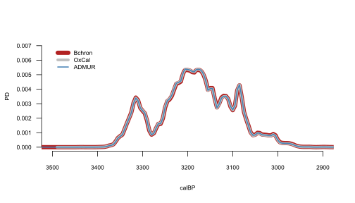
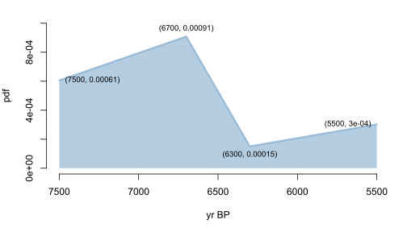

<style>
p.caption {font-size: 0.7em;}
</style>

**!! UNDER CONSTRUCTION. COMPLETION EXPECTED END OF SEPT 2020 !!**

This vignette provides a comprehensive guide to modelling population dynamics using the R package ADMUR, and accompanies the publication 'Directly modelling population dynamics in the South American Arid Diagonal using 14C dates', Philosophical Transactions B, 2020, A. Timpson et al. https://doi.org/10.1098/rstb.2019.0723  It assumes the user has some basic familiarity with programming in R. 

In addition to some basic information on getting started, this vignette is divided into three main parts:

1. **Date calibration and SPDs:**  Calibrate individual radiocarbon dates, generate Summed Probability Distributions, and automatically phase large datasets to adjust for ascertainment bias. Comparison with other software.
1. **Continuous Piecewise Linear (CPL) Modelling:** Parameter estimation using the likelihood function, and its application in MCMC for estimating credible intervals. Model selection using BIC, and the goodness-of-fit (GOF) test.
1. **SPD simulation testing:** Null hypothesis testing by simulating SPDs and comparing to the observed SPD. P-values generated using likelihoods, improving on the summary statistics originally devised in Shennan et al 2013 and Timpson et al 2014.

## Installation

The ADMUR package can be installed directly from GitHub, after installing and loading the 'devtools' package on the CRAN:

```{r, eval = FALSE}
install.packages('devtools')
library(devtools)
install_github('UCL/ADMUR')
```

The ADMUR package can then be locally loaded:

```{r, message = FALSE}
library(ADMUR)
```

## 14C datasets

A summary of the available help files and data sets included in the package can be browsed, which include a terrestrial anthropogenic ^14^C dataset from the South American Arid Diagonal:

```{r, eval = FALSE}
help(ADMUR)
help(arid)
```

Datasets must be structured as a data frame that include columns 'age' and 'sd', which represent the uncalibrated ^14^C age and its error, respectively.


```{r, eval = TRUE}
arid[1:5,1:8]
```
**********
# Part 1
# Date calibration and SPDs

The algorithm used by ADMUR to calculate model likelihoods of a ^14^C dataset uses several functions to first calibrate ^14^C dates. These functions are also intrinsically useful for ^14^C date calibration or for generating a Summed Probability Distribution (SPD).

## Calibrated ^14^C date probability distributions

Generating a single calibrated date distribution or SPD requires either a two-step process to give the user full control of the date range and temporal resolution, or a simpler one step process using a wrapper function that automatically estimates a sensible date range and resolution from the dataset, performs the two step process internally, and plots the SPD.

### With the wrapper

1. Use the function [summedCalibratorWrapper()](../html/summedCalibratorWrapper.html) 

```{r, eval = TRUE, fig.height = 4, fig.width=7, fig.align = "center", dev='svg', warning=FALSE}
data <- data.frame( age=c(6562,7144), sd=c(44,51) )
x <- summedCalibratorWrapper(data)
```

Notice the function automatically assumed the data provided were all ^14^C dates. However, if you have other kinds of date such as thermoluminescence you can specify this. Non-^14^C types are assumed to be in calendar time, BP. You can also specify a particular calibration curve:

```{r, eval = TRUE, fig.height = 4, fig.width=7, fig.align = "center", dev='svg', warning=FALSE}
data <- data.frame( age=c(6562,7144), sd=c(44,51), datingType=c('14C','TL') )
x <- summedCalibratorWrapper(data=data, calcurve=shcal20)
```

### Without the wrapper

Generating the SPD without the wrapper gives you more control, and requires a two-step process:

1. Convert a calibration curve to a CalArray using the function [makeCalArray()](../html/makeCalArray.html)
1. Calibrate the ^14^C dates through the CalArray using the function [summedCalibrator()](../html/summedCalibrator.html).

This is useful for improving computational times if generating many SPDs, for example in a simulation framework, since the CalArray needs generating only once. 

```{r, eval = TRUE, fig.height = 4, fig.width=7, fig.align = "center", dev='svg', warning=FALSE}
data <- data.frame( age = c(9144), sd=c(151) )
CalArray <- makeCalArray( calcurve=intcal20, calrange=c(8000,13000) )
cal <- summedCalibrator(data, CalArray)
plotPD(cal)
```

The CalArray is essentially a two-dimensional probability array of the calibration curve, and can be viewed using the [plotCalArray()](../html/plotCalArray.html) function. Calibration curves vary in their temporal resolution, and the preferred resolution can be specified using the parameter **inc** which interpolates the calibration curve.
It would become prohibitively time and memory costly if analysing the entire 50,000 year range of the calibration curve at a 1 year resolution (requiring a 50,000 by 50,000 array) and in practice the default 5 year resolution provides equivalent results to 1 year resolution for study periods wider than c.1000 years. 

```{r, eval = TRUE, fig.height = 5, fig.width=5, fig.align = "center", dev='jpeg'}
x <- makeCalArray( calcurve=shcal20, calrange=c(5500,6000), inc=1 )
plotCalArray(x)
```


## Calibration comparison with other software

It is worth noting that the algorithm used by this package to calibrate ^14^C dates gives practically equivalent results to those from [OxCal](https://c14.arch.ox.ac.uk/oxcal.html) generated using [OxcAAR](https://cran.r-project.org/web/packages/oxcAAR/index.html) and [Bchron](https://cran.r-project.org/web/packages/Bchron/index.html) 



However, there are two fringe circumstances where these software programs differ substantially: at the border of the calibration curve; and if a date has a large error.

### Border effects 

Consider the real ^14^C date [MAMS-13035](https://doi.org/10.1016/j.aeae.2015.11.003) age: 50524 +/- 833 BP calibrated through intcal13, which only extends to 46401BP. Bchron throws an error, whilst OxCal applies a one-to-one mapping between Conventional Radiocarbon (CRA) time and calendar time for any date (mean) beyond the range of the calibration curve. The latter is in theory a reasonable way to mitigate the problem, however OxCal applies this in a binary manner that can create peculiarities. Instead ADMUR gradually fades the calibration curve to a one-to-one mapping between the end of the curve and 60,000 BP. 


### Large errors 

A ^14^C date is typically reported as a mean date with an error, which is often interpreted as representing a symmetric Gaussian distribution before calibration. However, a Gaussian has a non-zero probability at all possible years (between -$\infty$ and +$\infty$), and therefore cannot fairly represent the date uncertainty which must be skewed towards the past. Specifically, if we consider the date in CRA time, it must have a zero probability of occurring in the future. Alternatively, if we consider the date as a ^14^C/^12^C ratio, it cannot be smaller than 1 (the present). Therefore ADMUR assumes a ^14^C date error is lognormally distributed with a mean equal to the CRA date, and a variance equal to the CRA error squared. This naturally skews the distribution away from the present. In practice, this difference is undetectably trivial for typical radiocarbon errors since the lognormal distribution approximates a normal distribution away from zero. However, theoretically the differences can be large if considering dates with large errors that are close to the present.

![Comparison of calibration software for the ^14^C dates 15000 +/- 9000 BP, 15000 +/- 3000 BP and 15000 +/- 1000 BP, using intcal13. Differences are apparent if a date has a large error (top tile): Bchron assumes the CRA error is Normally distributed, resulting in a truncated curve with a substantial probability at present. OxCal produces a heavily skewed distribution with a low probability at present and a substantial probability at 50,000 BP that suddenly truncates to zero beyond this (total probability mass of all three curves equals 1). ADMUR assumes the CRA error is Lognormally distributed.](software compare 3.svg)

## Phased data: adjusting for ascertainment bias

A naive approach to generating an SPD as a proxy for population dynamics would be to sum all dates in the dataset, but a more sensible approach is to sum the SPDs of each phase. The need to bin dates into phases is an important step in modelling population dynamics to adjust for the data ascertainment bias of some archaeological finds having more dates by virtue of a larger research interest or budget. 

Therefore [phaseCalibrator()](../html/phaseCalibrator.html) generates an SPD for each phase in a dataset, and includes a binning algorithm which provides a useful solution to handling large datasets that have not been phased. For example, consider the following 8 dates from 2 sites:

```{r, eval = TRUE}
data <- subset( arid, site %in% c('Carrizal','Pacopampa') )
data[,2:7]
```

The data have not already been phased (do not include a column 'phase') therefore the default binning algorithm calibrates these dates into 4 phases. this is achieved by binning dates that have a mean ^14^C date within 200 ^14^C years of any other date in that respective bin. Therefore Pacopampa.1 comprises samples 1207 and 1206, Pacopampa.2 comprises sample 1205, Carrizal.1 comprises samples 1196 and 1195 and 1194 and 1193, and Carrizal.2 comprises sample 1192:


```{r, eval = TRUE, fig.height = 4, fig.width=7, fig.align = "center", dev='svg', warning=FALSE}
CalArray <- makeCalArray( calcurve=shcal20, calrange=c(2000,6000) )
x <- phaseCalibrator(data=data, CalArray=CalArray)
plotPD(x)
```

Finally, the distributions in each phase can be summed and normalised to unity. It is straight forward to achieve this directly from the dataframe created above: 

```{r, eval = TRUE}
SPD <- as.data.frame( rowSums(x) )

# normalise
SPD <- SPD/( sum(SPD) * CalArray$inc )
```

Alternatively, the wrapper function [summedPhaseCalibrator()](../html/summedPhaseCalibrator.html) will perform this entire workflow internally:

```{r, eval = TRUE, fig.height = 4, fig.width=7, fig.align = "center", dev='svg', warning=FALSE}
SPD <- summedPhaseCalibrator( data=data, calcurve=shcal20, calrange=c(2000,6000) )
plotPD(SPD)
```

**********
# Part 2
# Continuous Piecewise Linear (CPL) Modelling

A CPL model lends itself well to the objectives of identifying specific demographic events. Its parameters are the (x,y) coordinates of the hinge points, which are the relative population size (y) and timing (x) of these events. Crucially, this package calculates model likelihoods (the probability of the data given some proposed parameter combination). This likelihood is used in a search algorithm to find the maximum likelihood parameters; to compare models with different numbers parameters to find the best fit without overfitting; in Monte-Carlo Markov Chain (MCMC) analysis to estimate credible intervals of those parameters; and in a goodness-of-fit test to check that the data is a typical realisation of the maximum likelihood model and its parameters.

## Calculating likelihoods

Theoretically a calibrated date should be a continuous Probability Density Function (PDF), however in practice a date is represented as a discrete vector of probabilities corresponding to each calendar year, and therefore is a Probability Mass Function (PMF). This discretisation provides the advantage that numerical methods can be used to easily calculate likelihoods, provided the model is also discretised to the same time points. 

A [toy()](../html/toy.html) model and population is provided to demonstrate how this achieved. Notice the toy population covers a slightly wider date range to ensure simulated ^14^C dates are well represented around the edges. First, we simulate a plausible ^14^C dataset and calibrate it:

```{r, eval = TRUE}
# Simulate 99 archaeological samples in proportion to the toy population dynamics
pop.years <- as.numeric( row.names(toy$population) )
mod.years <- as.numeric( row.names(toy$model) )
set.seed(12345)
cal <- sample(x=pop.years, size=99, replace=TRUE, prob=toy$population$individuals ) 

# Convert to 14C dates. 14C errors are borrowed from the real dataset 'arid' for realism.
age <- uncalibrateCalendarDates(dates=cal, calcurve=shcal20)
sd <- sample(x=arid$sd, size=99, replace=TRUE)
data <- data.frame(age=age, sd=sd, phase=1:99, datingType='14C')

# Calibrate each phase, taking care to restrict to the modelled date range
CalArray <- makeCalArray( calcurve=shcal20, calrange=range(mod.years), inc = 1 )
PD <- phaseCalibrator(data=data, CalArray=CalArray)
```

Next we remove any calibrated dates with less than 50% of their PD within the modelled date range. This is a crucial step to avoid mischievous edge effects of dates outside the date range. Similarly, notice we constrained the CalArray to the modelled date range. These are important to ensure that we only model the population across a range that is well represented by data. To extend the model beyond the range of available data would be to assume the absence of evidence means evidence of absence. No doubt there may be occasions when this is reasonable (for example if modelling the first colonisation of an island that has been well excavated, and the period before arrival is evidenced by the absence of datable material), but more often the range of representative data is due to research interest, and therefore the logic of only including dates with at least 50% of their PD within the date range is that their true dates are more likely to be internal (within the date range) than external. This effectively reduces the sample size from 99 to n=88:

```{r, eval = TRUE}
i <- colSums(PD) >= (0.5 / CalArray$inc) 
PD <- PD[,i] 
print( ncol(PD) )
```

Finally we calculate the overall log likelihood of the model given the data:

```{r, eval = TRUE}
loglik(PD=PD, model=toy$model)
```

For comparison, we can calculate the overall likelihood of a uniform model given exactly the same data. Intuitively this should have a lower likelihood, since our dataset was randomly generated from the non-uniform toy population history:

```{r, eval = TRUE}
uniform.model <- toy$model
uniform.model$pdf <- 1/nrow(uniform.model)
loglik(PD, uniform.model)
```

And indeed the toy model is seven million times more likely than the uniform model:
```{r, eval = TRUE}
exp( loglik(PD=PD, model=toy$model) - loglik(PD=PD, model=uniform.model) )
```


## The anatomy of a CPL model

Having established how to calculate the likelihood of any proposed model given a dataset, we can use any out-of-the-box search algorithm to find the maximum likelihood model. This first requires us to describe the PDF of any population model in terms of a small number of parameters, rather than a vector of probabilities for each year.

We achieve this using the Continuous Piecewise Linear (CPL) model, which can be described using the (x,y) coordinates of its hinge points.



When performing a search for the best 3-CPL model coordinates (given a dataset), only five of these eight values are free parameters. The x-coordinates of the start and end (5500 BP and 7500 BP) are fixed by the choice of date range. Additionally, one of the y-coordinates must be constrained by the other parameters, since the total area of this PDF must equal 1. As a result, an n-CPL model will have 2n-1 free parameters.

## Parameter space: The Area Breaking Process

We use the function [convertPars()](../html/convertPars.html) to map our search parameters to their corresponding PDF coordinates. This allows us to propose independent parameter values from a uniform distribution between 0 and 1, and convert them into coordinates that describe a corresponding CPL model PDF. This parameter-to-coordinate mapping is achieved using a modified stick breaking Dirichlet process. 

The Dirichlet Process (not to be confused with the Dirichlet distribution) is an algorithm that can break a stick (the x-axis date range) into a desired number of pieces, ensuring all lengths are sampled evenly. The length (proportion) of remaining stick to break (at each iteration) is chosen by sampling from the Beta distribution, such that we use the Beta CDF (with $\alpha$ = 1 and $\beta$ = the number of pieces still to be broken) to convert an x-parameter into its equivalent x-coordinate value. We extend this algorithm into two-dimensions by also sampling from a Gamma distribution on the y-axis, such that we use the Gamma CDF (with $\alpha$ = 1 and $\beta$ = 1) to convert a y-parameter (between 0 and 1) into its equivalent coordinate value between 0 and +$\infty$.

The algorithm proceeds as follows:

1. At the first hinge (H1, x = 5500 BP) convert the first y-parameter into the H1 y-coordinate using the Gamma CDF.
1. At the next hinge (H2) convert the second y-parameter into the H2 y-coordinate using the Gamma CDF.
1. Use the above y-coordinates (y~H1~ and y~H2~) to calculate the maximum possible H2 x-coordinate. This is achieved by assuming the PDF area so far (to the left of H2) equals 1. Or in other words by assuming the remaining hinges all have a y-coordinate equal to zero and the x-coordinate of H3 is infinitely close to H2. Convert the first x-parameter into x~H2~ by multiplying the Beta CDF by max(x~H2~). 
1. Repeat steps 2 and 3 for subsequent hinges.

The algorithm continues until the penultimate hinge, which differs slightly since the maximum possible x-coordinate is constrained not just by the area so far (to the left) but also a minimum triangle area to the right. Therefore at the penultimate hinge we convert the last x-parameter first, by multiplying the Beta CDF by max(x~Hpenultimate~) Notice in the case of a 1-CPL model the first hinge is also the penultimate hinge, so in this special case the first y-parameter is converted into the H1 y-coordinate using a uniform distribution between 0 and 2.

Finally the coordinates of the last hinge are not free. This is because the x-coordinate is already defined as 7500 BP and the y-coordinate is calculated exactly using the other coordinates and the constraint that the total area equals 1.


The parameters must be provided as a single vector with an odd length, each between 0 and 1 (y,x,y,x,...y). For example, a randomly generated 6-CPL model will have 11 parameters and 7 hinges:

```{r, eval = TRUE}
set.seed(12345)
convertPars( pars=runif(11), years=5500:7500, type='CPL' )
```

Note: The Area Breaking Algorithm is a heuristic that ensures all parameter space is explored and therefore the maximum likelihood parameters are always found. However, unlike the one-dimensional stick-breaking process, its mapping of random parameters to PDF coordinates is not perfectly even, and we welcome ideas for a more elegant algorithm.

## Maximum Likelihood parameter search

Any preferred search algorithm can be used. For example, the JDEoptim function from [DEoptimR](https://cran.r-project.org/web/packages/DEoptimR/index.html) uses a differential evolution optimisation algorithm that performs very nicely for this application. We recommend increasing the default NP parameter to 20 times the number of parameters:

```{r, eval = FALSE}
library(DEoptimR)
best <- JDEoptim(lower = rep(0,5), 
	upper = rep(1,5), 
	fn = objectiveFunction, 
	PDarray = PD, 
	type = 'CPL', 
	NP = 100,
	Trace = TRUE)
```

```{r, echo = FALSE}
load('C:/Users/adrian/Documents/FILES/analysis/spanning/ramiro/2019/github/vignette.JDEoptim.best.RData')
```

```{r, eval = TRUE, fig.height = 4, fig.width=7, fig.align = "center", dev='svg', warning=FALSE}
CPL <- convertPars(pars=best$par, years=5500:7500, type='CPL')
SPD <- summedPhaseCalibrator( data=data, calcurve=shcal20, calrange=c(5500,7500) )
plotPD(SPD)
lines(CPL$year, CPL$pdf, lwd=2, col='firebrick')
legend(x=6300, y=max(CPL$pdf), cex=0.7, lwd=2, col='firebrick', bty='n', legend= 'best fitted 3-CPL')
```

## Credible interval parameter search using MCMC

The ADMUR function [mcmc()](../html/mcmc.html) uses the Metropolis-Hastings algorithm to search joint parameter values of an n-CPL model, given a the calibrated probability distributions of phases in a ^14^C dataset (PDarray).

```{r, eval = FALSE}
chain <- mcmc(PDarray=PD, startPars=best$par, N=30000, burn=2000, thin=5, jumps =0.1)
```

```{r, echo = FALSE}
load('C:/Users/adrian/Documents/FILES/analysis/spanning/ramiro/2019/github/vignette.MCMC.RData')
```

The output of one mcmc chain provides the 2n-1 parameters between 0 and 1, and distributions can be plotted. The credible regions are wide because we generated a small dataset for this toy example (N = 99). It is also important to note that these are only marginal distributions (attempts to view a 5-dimensional distribution in just 2 dimensions) so their complex shape cannot adequately show the true 5D densities. Therefore the maximum likelihood (red points) will not necessarily be located on the densest part of the cloud. 


```{r, eval = TRUE, fig.height = 4, fig.width=7, fig.align = "center", dev='svg', warning=FALSE}
require(scales)
par(mfrow = c(1,2), mar = c(4,4,2,2))
plot(chain$res[,1], chain$res[,3], pch = 16, col = alpha(1,0.1))
points(best$par[1], best$par[3], col = 'red', pch = 16, cex = 1.5)
plot(chain$res[,1], chain$res[,4], pch = 16, col = alpha(1,0.1))
points(best$par[1], best$par[4], col = 'red', pch = 16, cex = 1.5)
```

However, we are really interested in converting these parameters into the x,y coordinates of the CPL model's hinge points, which can be achieved using the [convertPars()](../html/convertPars.html) function:

```{r, eval = TRUE, fig.height = 4, fig.width=7, fig.align = "center", dev='svg', warning=FALSE}
hinges <- convertPars(pars=chain$res, years=5500:7500, type='CPL')
par( mfrow=c(1,2) , mar = c(4,4,2,2) )
plot(hinges$yr2, hinges$pdf2, pch=16, col=alpha(1,0.1), ylim=c(0,0.0006))
points(CPL$year[2], CPL$pdf[2], col='red', pch=16, cex=1.5)
plot(hinges$yr3, hinges$pdf3, pch=16, col=alpha(1,0.1), ylim=c(0,0.0014))
points(CPL$year[3], CPL$pdf[3], col='red', pch=16, cex=1.5) 
```

Alternatively, the joint distributions can be visualised by plotting the CPL model for each iteration of the chain, with the MLE in red:

```{r, eval = TRUE, fig.height = 4, fig.width=7, fig.align = "center", dev='svg', warning=FALSE}
plot(NULL, xlim=c(7500,5500),ylim=c(0,0.0013), xlab='calBP', ylab='PD')
for(n in 1:nrow(hinges)){
	x <- c(hinges$yr1[n], hinges$yr2[n], hinges$yr3[n], hinges$yr4[n])
	y <- c(hinges$pdf1[n], hinges$ pdf2[n], hinges$pdf3[n], hinges$pdf4[n])
	lines( x, y, col=alpha(1,0.02) )
	}
lines(x=CPL$year, y=CPL$pdf, lwd=2, col='firebrick')
```

## Model selection using BIC 

A fundamentally important issue in modelling is the need to avoid overfitting an unjustifiably complex model to data, by using a formal model selection approach. In the example above we arbitrarily chose a 3-CPL model to fit to the data (since the data was randomly sampled from a 3-CPL toy population), however, given the small sample size (n = 88) it is possible a simpler model may have better predictive power. ADMUR achieves this using the so-called Bayesian Information Criterion (BIC) aka Schwarz Information Criterion, which balances the model likelihood against the number of parameters and sample size.

Therefore we should also find the Maximum Likelihood for other plausible models such as a 2-CPL, 1-CPL, exponential and even a uniform:

```{r, eval = FALSE}
# CPL parameters must be between 0 and 1
CPL.1 <- JDEoptim(lower=0, upper=1, fn=objectiveFunction, PDarray=PD, type='CPL', NP=20)
CPL.2 <- JDEoptim(lower=rep(0,3), upper=rep(1,3), fn=objectiveFunction, PDarray=PD, type='CPL', NP=60)
CPL.3 <- JDEoptim(lower=rep(0,5), upper=rep(1,5), fn=objectiveFunction, PDarray=PD, type='CPL', NP=100)

# exponential has a single parameter, which can be negative (decay)
exp <- JDEoptim(lower=-0.01, upper=0.01, fn=objectiveFunction, PDarray=PD, type='exp', NP=20)

# uniform has no parameters so a search is not required.
uniform <- objectiveFunction(NULL, PD, type='uniform')
```

```{r, echo = FALSE}
load('C:/Users/adrian/Documents/FILES/analysis/spanning/ramiro/2019/github/vignette.model.comparison.RData')
```

The objective function returns the negative log-likelihood since the search algorithm seeks to minimise the objective function. It is therefore trivial to extract the log-likelihoods, and calculate the BIC scores using the formula $BIC=k\ln(n)-2L$ where $k$ is the number of parameters, $n$ is the effective sample size (i.e. the number of phases = 88), and $L$ is the maximum log-likelihood.

```{r, eval = TRUE}
BIC.1 <- 1*log(88)-2*(-CPL.1$value)
BIC.2 <- 3*log(88)-2*(-CPL.2$value)
BIC.3 <- 5*log(88)-2*(-CPL.3$value)
BIC.exp <- 1*log(88)-2*(-exp$value)
BIC.uniform <- -2*(-uniform)

data.frame(L1=-CPL.1$value,L2=-CPL.2$value,L3=-CPL.3$value,Lexp=-exp$value,Lunif=-uniform)
data.frame(BIC.1,BIC.2,BIC.3,BIC.exp,BIC.uniform)
```

Therefore although the 3-CPL model has the highest log-likelihood, the fit is not justified by the model complexity. Instead, the exponential model has the lowest BIC and is selected as the best. 

Nevertheless, we can convert the parameters into model PDFs, and plot:
```{r, eval = TRUE, fig.height = 4, fig.width=7, fig.align = "center", dev='svg', warning=FALSE}
# convert parameters to model PDFs
CPL1 <- convertPars(pars=CPL.1$par, years=mod.years, type='CPL') 
CPL2 <- convertPars(pars=CPL.2$par, years=mod.years, type='CPL')  
CPL3 <- convertPars(pars=CPL.3$par, years=mod.years, type='CPL')  
EXP <- convertPars(pars=exp$par, years=mod.years, type='exp')  

# Plot SPD and all four competing models:
plotPD(SPD)
cols <- c('firebrick','orchid2','coral2','goldenrod3')
lines(CPL1$year, CPL1$pdf, col=cols[1], lwd=2)
lines(CPL2$year, CPL2$pdf, col=cols[2], lwd=2)
lines(CPL3$year, CPL3$pdf, col=cols[3], lwd=2)
lines(EXP$years, EXP$pdf, col=cols[4], lwd=2)
legend <- c('best 1-CPL model','best 2-CPL model','best 3-CPL model','best exponential model')
legend(x=6300, y=max(CPL$pdf), cex=0.7, lwd=2, col=cols, bty='n', legend=legend)
```

## Goodness of fit (GOF) test.

Distribution of likelihoods etc.

**********

# Part 3
# SPD simulation testing

Lean on some text from paper about why this isn't a very sophisticated approach. Explain key improvement that the summary statistic is the likelihood.
