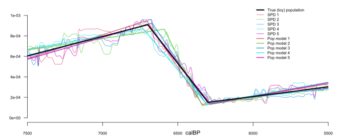
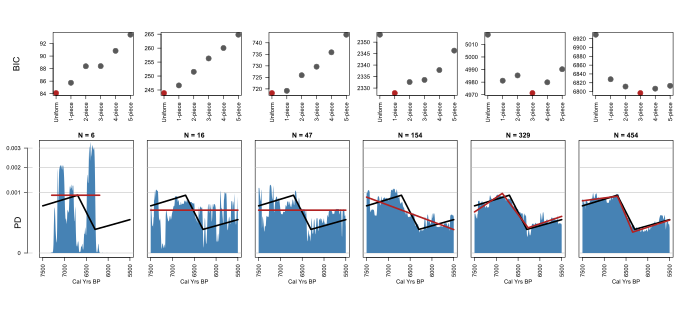
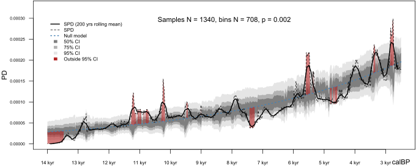
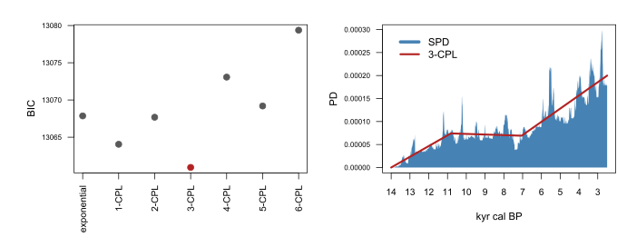
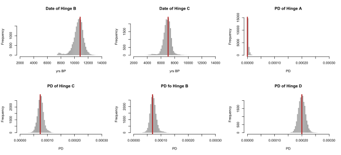
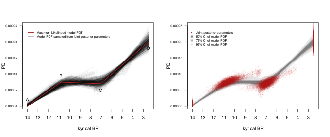

<style>
p.caption {font-size: 0.7em;}
</style>

**********
This vignette provides the R code used to generate all results, plots and tables in the following publication: 

### Directly modelling population dynamics in the South American Arid Diagonal using 14C dates by Adrian Timpson, Ramiro Barberena, Mark G. Thomas, Cesar Mendez and Katie Manning, published in Philosophical Transactions of the Royal Society B, 2020. https://doi.org/10.1098/rstb.2019.0723 

The only exception to this is the exclusion of R code for figure 3, which is an adaptation of [Fig 7 from Peel et al 2007](https://doi.org/10.5194/hess-11-1633-2007) and is therefore not novel.

Each section of this vignette provides stand alone R code that is not reliant on objects created earlier in the vignette. As such, there is some repetition between sections. Setting random seeds is not necessary, but can be used to ensure random components are identical to those used in the publication. The generation and calibration of each random dataset takes seconds to complete. Simulation tests and searches performed by JDEoptim or the generation of MCMC chains then requires several hours to complete. Therefore the code for each section is separated into two or more blocks. The first block always includes all slow components which are saved by the last line of code. This provides a firewall to allow plots to be quickly generated on a later occasion using the remaining block(s), which runs in seconds. Sometimes there is an intermediate block which takes a few seconds to perform some pre-plot processing. 

**********
# Figure 1

## Simulating datasets from a 3-CPL toy.

Generate key objects:

```{r, eval = FALSE}
library(ADMUR)
library(DEoptimR)
N <- 1500

# generate 5 sets of random calendar dates under the toy model. 
set.seed(882)
cal1 <- simulateCalendarDates(model = toy, N)
set.seed(884)
cal2 <- simulateCalendarDates(model = toy, N)
set.seed(886)
cal3 <- simulateCalendarDates(model = toy, N)
set.seed(888)
cal4 <- simulateCalendarDates(model = toy, N)
set.seed(890)
cal5 <- simulateCalendarDates(model = toy, N)

# Convert to 14C dates. 
age1 <- uncalibrateCalendarDates(cal1, shcal20)
age2 <- uncalibrateCalendarDates(cal2, shcal20)
age3 <- uncalibrateCalendarDates(cal3, shcal20)
age4 <- uncalibrateCalendarDates(cal4, shcal20)
age5 <- uncalibrateCalendarDates(cal5, shcal20)

# construct data frames. One date per phase.
data1 <- data.frame(age = age1, sd = 25, phase = 1:N, datingType = '14C')
data2 <- data.frame(age = age2, sd = 25, phase = 1:N, datingType = '14C')
data3 <- data.frame(age = age3, sd = 25, phase = 1:N, datingType = '14C')
data4 <- data.frame(age = age4, sd = 25, phase = 1:N, datingType = '14C')
data5 <- data.frame(age = age5, sd = 25, phase = 1:N, datingType = '14C')

# Calibrate each phase, taking care to restrict to the modelled date range
CalArray <- makeCalArray(shcal20, calrange = range(toy$year), inc = 5)

PD1 <- phaseCalibrator(data1, CalArray, remove.external = TRUE)
PD2 <- phaseCalibrator(data2, CalArray, remove.external = TRUE)
PD3 <- phaseCalibrator(data3, CalArray, remove.external = TRUE)
PD4 <- phaseCalibrator(data4, CalArray, remove.external = TRUE)
PD5 <- phaseCalibrator(data5, CalArray, remove.external = TRUE)

# Generate SPD of each dataset
SPD1 <- summedCalibrator(data1, CalArray, normalise='full')
SPD2 <- summedCalibrator(data2, CalArray, normalise='full')
SPD3 <- summedCalibrator(data3, CalArray, normalise='full')
SPD4 <- summedCalibrator(data4, CalArray, normalise='full')
SPD5 <- summedCalibrator(data5, CalArray, normalise='full')

# 3-CPL parameter search
lower <- rep(0,5)
upper <- rep(1,5)
fn <- objectiveFunction
best1 <- JDEoptim(lower, upper, fn, PDarray=PD1, type='CPL',trace=T,NP=100)
best2 <- JDEoptim(lower, upper, fn, PDarray=PD2, type='CPL',trace=T,NP=100)
best3 <- JDEoptim(lower, upper, fn, PDarray=PD3, type='CPL',trace=T,NP=100)
best4 <- JDEoptim(lower, upper, fn, PDarray=PD4, type='CPL',trace=T,NP=100)
best5 <- JDEoptim(lower, upper, fn, PDarray=PD5, type='CPL',trace=T,NP=100)

#save results, for separate plotting
save(best1,best2,best3,best4,best5,SPD1,SPD2,SPD3,SPD4,SPD5, file='results.RData',version=2)
```

Generate plot:

```{r, eval = FALSE}
library(ADMUR)
load('results.RData')

svg('Fig1.svg',height=4,width=10)
par(mar=c(2,4,0.1,2))
plot(NULL, xlim=c(7500,5500), ylim=c(0,0.0011), xlab='', ylab='', xaxs='i',cex.axis=0.7, bty='n',las=1)
axis(1,at=6400,labels='calBP',tick=F)
axis(2,at=-0.00005,labels='PD',tick=F, las=1)
lwd1 <- 1
lwd2 <- 2
lwd3 <- 3
legend(x=6000, y = 0.0011, bty='n', cex=0.7, 
	legend=c('True (toy) population',
		'SPD 1',
		'SPD 2',
		'SPD 3',
		'SPD 4',
		'SPD 5',
		'Pop model 1',
		'Pop model 2',
		'Pop model 3',
		'Pop model 4',
		'Pop model 5'),
	lwd=c(lwd3,rep(lwd1,5),rep(lwd2,5)),
	col=c(1,2:6,2:6)
	)

years <- as.numeric(row.names(SPD1))

# plot SPDs
lines(years,SPD1[,1],col=2, lwd=lwd1)
lines(years,SPD2[,1],col=3, lwd=lwd1)
lines(years,SPD3[,1],col=4, lwd=lwd1)
lines(years,SPD4[,1],col=5, lwd=lwd1)
lines(years,SPD5[,1],col=6, lwd=lwd1)

# convert parameters to model pdfs
mod.1 <- convertPars(pars=best1$par, years=years, type='CPL')
mod.2 <- convertPars(pars=best2$par, years=years, type='CPL')
mod.3 <- convertPars(pars=best3$par, years=years, type='CPL')
mod.4 <- convertPars(pars=best4$par, years=years, type='CPL')
mod.5 <- convertPars(pars=best5$par, years=years, type='CPL')

lines(mod.1$year,mod.1$pdf,col=2,lwd=lwd2)
lines(mod.2$year,mod.2$pdf,col=3,lwd=lwd2)
lines(mod.3$year,mod.3$pdf,col=4,lwd=lwd2)
lines(mod.4$year,mod.4$pdf,col=5,lwd=lwd2)
lines(mod.5$year,mod.5$pdf,col=6,lwd=lwd2)

# plot true toy model
lines(toy$year, toy$pdf, lwd=lwd3)

dev.off()
```



**********

# Figure 2

## Model selection with small simulated data.

Generate key objects:

```{r, eval = FALSE}
library(ADMUR)
library(DEoptimR)
set.seed(888)
N <- c(6,20,60,180,360,540)
names <- c('sample1','sample2','sample3','sample4','sample5','sample6')

# generate 6 sets of random calendar dates under the toy model. 
cal1 <- simulateCalendarDates(model = toy, N[1])
cal2 <- simulateCalendarDates(model = toy, N[2])
cal3 <- simulateCalendarDates(model = toy, N[3])
cal4 <- simulateCalendarDates(model = toy, N[4])
cal5 <- simulateCalendarDates(model = toy, N[5])
cal6 <- simulateCalendarDates(model = toy, N[6])

# Convert to 14C dates. 
age1 <- uncalibrateCalendarDates(cal1, shcal20)
age2 <- uncalibrateCalendarDates(cal2, shcal20)
age3 <- uncalibrateCalendarDates(cal3, shcal20)
age4 <- uncalibrateCalendarDates(cal4, shcal20)
age5 <- uncalibrateCalendarDates(cal5, shcal20)
age6 <- uncalibrateCalendarDates(cal6, shcal20)

# construct data frames. One date per phase.
data1 <- data.frame(age = age1, sd = 25, phase = 1:N[1], datingType = '14C')
data2 <- data.frame(age = age2, sd = 25, phase = 1:N[2], datingType = '14C')
data3 <- data.frame(age = age3, sd = 25, phase = 1:N[3], datingType = '14C')
data4 <- data.frame(age = age4, sd = 25, phase = 1:N[4], datingType = '14C')
data5 <- data.frame(age = age5, sd = 25, phase = 1:N[5], datingType = '14C')
data6 <- data.frame(age = age6, sd = 25, phase = 1:N[6], datingType = '14C')

# narrow domain of the model to the range of data, 
# since absence of evidence in periods well outside the data should
# not be interpreted as evidence of absence.
# Only required when sample sizes are extremely small. 
# Otherwise the data domain is constrained by the model date range.
r1 <- estimateDataDomain(data1, shcal20)

# narrower range for extremely small samples
CalArray1 <- makeCalArray(shcal20, calrange = c( max(r1[1],5500) , min(r1[2],7500) ), inc = 5)
CalArray <- makeCalArray(shcal20, calrange = range(toy$year), inc = 5)

# Calibrate each phase
PD1 <- phaseCalibrator(data1, CalArray1, remove.external = TRUE)
PD2 <- phaseCalibrator(data2, CalArray, remove.external = TRUE)
PD3 <- phaseCalibrator(data3, CalArray, remove.external = TRUE)
PD4 <- phaseCalibrator(data4, CalArray, remove.external = TRUE)
PD5 <- phaseCalibrator(data5, CalArray, remove.external = TRUE)
PD6 <- phaseCalibrator(data6, CalArray, remove.external = TRUE)
PD <- list(PD1, PD2, PD3, PD4, PD5, PD6); names(PD) <- names

# Generate SPD of each dataset
SPD1 <- summedCalibrator(data1, CalArray, normalise='full')
SPD2 <- summedCalibrator(data2, CalArray, normalise='full')
SPD3 <- summedCalibrator(data3, CalArray, normalise='full')
SPD4 <- summedCalibrator(data4, CalArray, normalise='full')
SPD5 <- summedCalibrator(data5, CalArray, normalise='full')
SPD6 <- summedCalibrator(data6, CalArray, normalise='full')
SPD <- list(SPD1, SPD2, SPD3, SPD4, SPD5, SPD6); names(SPD) <- names

# Uniform model: No parameters. 
# Log Likelihood calculated directly using objectiveFunction, without a search required.
unif1.loglik <- -objectiveFunction(pars = NULL, PDarray = PD1, type = 'uniform') 
unif2.loglik <- -objectiveFunction(pars = NULL, PDarray = PD2, type = 'uniform') 
unif3.loglik <- -objectiveFunction(pars = NULL, PDarray = PD3, type = 'uniform') 
unif4.loglik <- -objectiveFunction(pars = NULL, PDarray = PD4, type = 'uniform') 
unif5.loglik <- -objectiveFunction(pars = NULL, PDarray = PD5, type = 'uniform') 
unif6.loglik <- -objectiveFunction(pars = NULL, PDarray = PD6, type = 'uniform') 
uniform <- list(unif1.loglik, unif2.loglik, unif3.loglik, unif4.loglik, unif5.loglik, unif6.loglik)
names(uniform) <- names

# Best 1-CPL model.  Parameters and log likelihood found using search
lower <- rep(0,1)
upper <- rep(1,1)
fn <- objectiveFunction
best1 <- JDEoptim(lower, upper, fn, PDarray=PD1, type='CPL',trace=T,NP=20)
best2 <- JDEoptim(lower, upper, fn, PDarray=PD2, type='CPL',trace=T,NP=20)
best3 <- JDEoptim(lower, upper, fn, PDarray=PD3, type='CPL',trace=T,NP=20)
best4 <- JDEoptim(lower, upper, fn, PDarray=PD4, type='CPL',trace=T,NP=20)
best5 <- JDEoptim(lower, upper, fn, PDarray=PD5, type='CPL',trace=T,NP=20)
best6 <- JDEoptim(lower, upper, fn, PDarray=PD6, type='CPL',trace=T,NP=20)
CPL1 <- list(best1, best2, best3, best4, best5, best6); names(CPL1) <- names

# Best 2-CPL model.  Parameters and log likelihood found using search
lower <- rep(0,3)
upper <- rep(1,3)
fn <- objectiveFunction
best1 <- JDEoptim(lower, upper, fn, PDarray=PD1, type='CPL',trace=T,NP=60)
best2 <- JDEoptim(lower, upper, fn, PDarray=PD2, type='CPL',trace=T,NP=60)
best3 <- JDEoptim(lower, upper, fn, PDarray=PD3, type='CPL',trace=T,NP=60)
best4 <- JDEoptim(lower, upper, fn, PDarray=PD4, type='CPL',trace=T,NP=60)
best5 <- JDEoptim(lower, upper, fn, PDarray=PD5, type='CPL',trace=T,NP=60)
best6 <- JDEoptim(lower, upper, fn, PDarray=PD6, type='CPL',trace=T,NP=60)
CPL2 <- list(best1, best2, best3, best4, best5, best6); names(CPL2) <- names

# Best 3-CPL model.  Parameters and log likelihood found using search
lower <- rep(0,5)
upper <- rep(1,5)
fn <- objectiveFunction
best1 <- JDEoptim(lower, upper, fn, PDarray=PD1, PDarray=PD1, type='CPL',trace=T,NP=100)
best2 <- JDEoptim(lower, upper, fn, PDarray=PD1, PDarray=PD2, type='CPL',trace=T,NP=100)
best3 <- JDEoptim(lower, upper, fn, PDarray=PD1, PDarray=PD3, type='CPL',trace=T,NP=100)
best4 <- JDEoptim(lower, upper, fn, PDarray=PD1, PDarray=PD4, type='CPL',trace=T,NP=100)
best5 <- JDEoptim(lower, upper, fn, PDarray=PD1, PDarray=PD5, type='CPL',trace=T,NP=100)
best6 <- JDEoptim(lower, upper, fn, PDarray=PD1, PDarray=PD6, type='CPL',trace=T,NP=100)
CPL3 <- list(best1, best2, best3, best4, best5, best6); names(CPL3) <- names

# Best 4-CPL model.  Parameters and log likelihood found using search
lower <- rep(0,7)
upper <- rep(1,7)
fn <- objectiveFunction
best1 <- JDEoptim(lower, upper, fn, PDarray=PD1, type='CPL',trace=T,NP=140)
best2 <- JDEoptim(lower, upper, fn, PDarray=PD2, type='CPL',trace=T,NP=140)
best3 <- JDEoptim(lower, upper, fn, PDarray=PD3, type='CPL',trace=T,NP=140)
best4 <- JDEoptim(lower, upper, fn, PDarray=PD4, type='CPL',trace=T,NP=140)
best5 <- JDEoptim(lower, upper, fn, PDarray=PD5, type='CPL',trace=T,NP=140)
best6 <- JDEoptim(lower, upper, fn, PDarray=PD6, type='CPL',trace=T,NP=140)
CPL4 <- list(best1, best2, best3, best4, best5, best6); names(CPL4) <- names

# Best 5-CPL model.  Parameters and log likelihood found using search
lower <- rep(0,9)
upper <- rep(1,9)
fn <- objectiveFunction
best1 <- JDEoptim(lower, upper, fn, PDarray=PD1, type='CPL',trace=T,NP=180)
best2 <- JDEoptim(lower, upper, fn, PDarray=PD2, type='CPL',trace=T,NP=180)
best3 <- JDEoptim(lower, upper, fn, PDarray=PD3, type='CPL',trace=T,NP=180)
best4 <- JDEoptim(lower, upper, fn, PDarray=PD4, type='CPL',trace=T,NP=180)
best5 <- JDEoptim(lower, upper, fn, PDarray=PD5, type='CPL',trace=T,NP=180)
best6 <- JDEoptim(lower, upper, fn, PDarray=PD6, type='CPL',trace=T,NP=180)
CPL5 <- list(best1, best2, best3, best4, best5, best6); names(CPL5) <- names

# save results, for separate plotting
save(SPD, PD, uniform, CPL1, CPL2, CPL3, CPL4, CPL5, file='results.RData',version=2)
```

Pre-plot processing:

```{r, eval = FALSE}
library(ADMUR)
load('results.RData')

# Calculate BICs for all six sample sizes and all six models
BIC <- as.data.frame(matrix(,6,6))
row.names(BIC) <- c('uniform','1-CPL','2-CPL','3-CPL','4-CPL','5-CPL')
for(s in 1:6){

	# extract  log likelihoods for each model
	loglik <- c(uniform[[s]], 
		-CPL1[[s]]$value, 
		-CPL2[[s]]$value, 
		-CPL3[[s]]$value, 
		-CPL4[[s]]$value, 
		-CPL5[[s]]$value)

	# extract effective sample sizes for each model
	N <- c(rep(ncol(PD[[s]]),6))

	# number of parameters for each model
	K <- c(0, 1, 3, 5, 7, 9)

	# calculate BIC for each model
	BIC[,s] <- log(N)*K - 2*loglik

	# store effective sample size
	names(BIC)[s] <- paste('N',N[1],sep='=')
	}

# Show all BICs for all sample sizes and models
print(BIC)
```

Generate plot:

```{r, eval = FALSE}
# Fig 2 plot
svg('Fig2.svg',height=6,width=13)
layout(mat=matrix(1:14, 2, 7, byrow = F),widths=c(0.3,rep(1,6)), heights=c(1,1.5),respect=T)
	
# plot two blanks first
par(mar=c(5,4,1.5,0),las=2)
ymax <- 0.0032
plot(NULL, xlim=c(0,1),ylim=c(0,1),main='', xlab='',ylab='',bty='n',xaxt='n',yaxt='n')
mtext(side=2, at=0.5,text='BIC',las=0,line=1)
plot(NULL, xlim=c(0,1),ylim=sqrt(c(0,ymax)),main='', xlab='',ylab='',bty='n',xaxt='n',yaxt='n')
axis(side=2, at=sqrt(seq(0,ymax,by=0.001)), labels=round(seq(0,ymax,by=0.001),4),las=1)
mtext(side=2, at=sqrt(0.00025),text='PD',las=0,line=0.8,cex=1)
abline(h=sqrt(seq(0,ymax,by=0.001)),col='grey')

for(n in 1:6){

	# extract the best model (lowest BIC)
	BICs <- BIC[,n]
	best <- which(BICs==min(BICs))
	
	# convert parameters to model
	if(best==1){
		type <- 'uniform'
		pars <- NULL
		}
	if(best!=1)type <- 'CPL'
	if(best==2)pars <- CPL1[[n]]$par 
	if(best==3)pars <- CPL2[[n]]$par 
	if(best==4)pars <- CPL3[[n]]$par 
	if(best==5)pars <- CPL4[[n]]$par 
	if(best==6)pars <- CPL5[[n]]$par 
 
	spd.years <- as.numeric(row.names(SPD[[n]]))
	spd.pdf <- SPD[[n]][,1]
	mod.years <- as.numeric(row.names(PD[[n]]))
	model <- convertPars(pars, mod.years, type)

	
	# plot
	red <- 'firebrick'
	col <- rep('grey35',6); col[best] <- red
	ymin <- min(BIC)-diff(range(BIC))*0.15
	par(mar=c(5,3,1.5,1),las=2)
	plot(BICs,xlab='',ylab='',xaxt='n',pch=20,cex=3,col=col, main='')
	axis(side=1, at=1:6, labels=c('Uniform','1-piece','2-piece','3-piece','4-piece','5-piece'))

	par(mar=c(5,1,1.5,1),las=2)
	plot(NULL,type='l', 
		xlab='Cal Yrs BP',
		ylab='',yaxt='n',
		col='steelblue', 
		main=paste('N =',ncol(PD[[n]])),
		ylim=sqrt(c(0,ymax)),
		xlim=c(7500,5500))
	abline(h=sqrt(seq(0,ymax,by=0.001)),col='grey')
	polygon(c(min(spd.years),spd.years,max(spd.years)),sqrt(c(0,spd.pdf,0)),col='steelblue',border=NA)

	lwd=3
	lines(toy$year,sqrt(toy$pdf),lwd=lwd)
	lines(model$year, sqrt(model$pdf), lwd=lwd, col=red)
	}
dev.off()
```



**********

# Figure 4

## SPD simulation analysis of SAAD data

Generate key objects:

```{r, eval = FALSE}
library(ADMUR)
set.seed(999)
# best exponential parameter previously found using ML search for Fig 5.
summary <- SPDsimulationTest(data=SAAD, 
	calcurve=shcal20, 
	calrange=c(2500,14000), 
	pars=-0.0001674152, 
	type='exp', 
	N=20000)
save(summary, file='results.RData',version=2)
```

Generate plot:

```{r, eval = FALSE}
library(ADMUR)
load('results.RData')
svg('Fig4.svg',height=4,width=10)
par(mar=c(2,4,0.1,0.1))
plotSimulationSummary(summary, legend.x=11500,legend.y=0.0003)
axis(side=1, at=2500,labels='calBP',tick=F)
dev.off()
```




**********


# Figure 5

## Model selection of SAAD data.

Generate key objects:

```{r, eval = FALSE}
library(ADMUR)
library(DEoptimR)

# Generate SPD 
SPD <- summedPhaseCalibrator(data=SAAD, calcurve=shcal20, calrange = c(2500,14000))

# Calibrate each phase
CalArray <- makeCalArray(calcurve=shcal20, calrange = c(2500,14000))
PD <- phaseCalibrator(data=SAAD, CalArray, remove.external = TRUE)

# Best exponential model.  Parameter and log likelihood found using seach
exp <- JDEoptim(lower=-0.01, upper=0.01, fn=objectiveFunction, PDarray=PD, type='exp', trace=T, NP=20)

# Best CPL models.  Parameters and log likelihood found using seach
fn <- objectiveFunction
CPL1 <- JDEoptim(lower=rep(0,1), upper=rep(1,1), fn, PDarray=PD, type='CPL',trace=T,NP=20)
CPL2 <- JDEoptim(lower=rep(0,3), upper=rep(1,3), fn, PDarray=PD, type='CPL',trace=T,NP=60)
CPL3 <- JDEoptim(lower=rep(0,5), upper=rep(1,5), fn, PDarray=PD, type='CPL',trace=T,NP=100)
CPL4 <- JDEoptim(lower=rep(0,7), upper=rep(1,7), fn, PDarray=PD, type='CPL',trace=T,NP=140)
CPL5 <- JDEoptim(lower=rep(0,9), upper=rep(1,9), fn, PDarray=PD, type='CPL',trace=T,NP=180)
CPL6 <- JDEoptim(lower=rep(0,11),upper=rep(1,11),fn, PDarray=PD, type='CPL',trace=T,NP=220)

# save results, for separate plotting
save(SPD, PD, exp, CPL1, CPL2, CPL3, CPL4, CPL5, CPL6, file='results.RData',version=2)
```

Pre-plot:

```{r, eval = FALSE}
library(ADMUR)
load('results.RData')

# Calculate BICs for all six models
# name of each model
model <- c('exponential','1-CPL','2-CPL','3-CPL','4-CPL','5-CPL','6-CPL')

# extract  log likelihoods for each model
loglik <- c(-exp$value, -CPL1$value, -CPL2$value, -CPL3$value, -CPL4$value, -CPL5$value, -CPL6$value)

# extract effective sample sizes
N <- c(rep(ncol(PD),7))

# number of parameters for each model
K <- c(1, 1, 3, 5, 7, 9, 11)

# calculate BIC for each model
BICs <- log(N)*K - 2*loglik

# convert best 3-CPL parameters into model pdf
best <- convertPars(pars=CPL3$par, years=c(2500,14000), type='CPL')
```

Generate plot:

```{r, eval = FALSE}
svg('Fig5.svg',height=4,width=10)
par(mfrow=c(1,2))

# model comparison
par(mar=c(6,6,2,0.1))
red <- 'firebrick'
blue <- 'steelblue'
col <- rep('grey35',7); col[which(BICs==min(BICs))] <- red
plot(BICs,xlab='',ylab='',xaxt='n', pch=20,cex=2,col=col,main='',las=1,cex.axis=0.7)
labels <- c('exponential','1-CPL','2-CPL','3-CPL','4-CPL','5-CPL','6-CPL')
axis(side=1, at=1:7, las=2, labels=labels, cex.axis=0.9)
mtext(side=2, at=mean(BICs),text='BIC',las=0,line=3)

# best fitting CPL
years <- as.numeric(row.names(SPD))
plot(NULL,xlim=rev(range(years)), ylim=range(SPD),
	type='l',xlab='kyr cal BP',xaxt='n', ylab='',las=1,cex.axis=0.7)
axis(1,at=seq(14000,3000,by=-1000), labels=seq(14,3,by=-1),cex.axis=0.9)
mtext(side=2, at=max(SPD[,1])/2,text='PD',las=0,line=3.5,cex=1)
polygon(c(min(years),years,max(years)),c(0,SPD[,1],0),col=blue,border=NA)
lines(best$year,best$pdf,col=red,lwd=3)

legend(x=14000,y=0.0003,lwd=c(5,3),col=c(blue,red),bty='n',legend=c('SPD','3-CPL'))
dev.off()
```



**********

# Figure 6, Figure 7, Table 2

## Parameter estimates and CI of SAAD data.

Generate key objects:

```{r, eval = FALSE}
library(ADMUR)
library(DEoptimR)

# Generate SPD 
SPD <- summedPhaseCalibrator(data=SAAD, calcurve=shcal20, calrange = c(2500,14000))

# Calibrate each phase
CalArray <- makeCalArray(calcurve=shcal20, calrange = c(2500,14000))
PD <- phaseCalibrator(data=SAAD, CalArray, remove.external = TRUE)

# starting parameters are taken from ML search
best.pars <- c(0.8498309, 0.5422777, 0.8995522, 0.5482174, 1.0000000)
chain <- mcmc(PDarray=PD, startPars=best.pars, type='CPL', N=100000, burn=2000, thin=5, jumps=0.02)

# save results, for separate plotting
save(chain, best.pars, file='results.RData',version=2)
```

Pre-plot processing:

```{r, eval = FALSE}
library('ADMUR')
library('scales')
load('results.RData')

# Convert Maximum Likelihood parameters to hinge coordinates
ML <- convertPars(best.pars,years=c(2500,14000), type='CPL')

# Convert MCMC chain of parameters to hinge coordinates
hinges <- convertPars(chain$res, years=c(2500,14000), type='CPL')

# check the acceptance ratio is sensible (c. 0.2 to 0.5)
chain$acceptance.ratio

# Eyeball the entire chain, before burn-in and thinning
par(mfrow=c(3,2))
for(n in 1:5)plot(chain$all.pars[,n], type='l', ylim=c(0,1))

# Generate CI for Fig 7
N <- nrow(hinges)
years <- 2500:14000
Y <- length(years)
pdf.matrix <- matrix(,N,Y)
for(n in 1:N){
	yr <- c('yr1','yr2','yr3','yr4')
	pdf <- c('pdf1','pdf2','pdf3','pdf4')
	pdf.matrix[n,] <- approx(x=hinges[n,yr],y=hinges[n,pdf],xout=years, ties='ordered')$y
	}
CI <- matrix(,Y,6)
for(y in 1:Y)CI[y,] <- quantile(pdf.matrix[,y],prob=c(0.025,0.125,0.25,0.75,0.875,0.975))
```

Generate Figure 6:

```{r, eval = FALSE}
svg('Fig6.svg',height=5,width=11)
par(mfrow=c(2,3))
lwd <- 3
red='firebrick'
grey='grey65'
breaks.yr <- seq(14000,2000,length.out=80)
breaks.pdf <- seq(0,0.0003,length.out=80)
xlab.yr <- 'yrs BP'
xlab.pdf <-'PD'
names <- c('Date of Hinge B','Date of Hinge C','PD of Hinge A','PD fo Hinge B','PD of Hinge C','PD of Hinge D')
hist(hinges$yr3, breaks=breaks.yr, col=grey, border=NA, main=names[1], xlab=xlab.yr)
abline(v = ML$year[3], col=red, lwd=lwd)
hist(hinges$yr2, breaks=breaks.yr, col=grey, border=NA, main=names[2], xlab=xlab.yr)
abline(v = ML$year[2], col=red, lwd=lwd)
hist(hinges$pdf4, breaks=breaks.pdf, col=grey, border=NA, main=names[3], xlab=xlab.pdf)
abline(v = ML$pdf[4], col=red, lwd=lwd)
hist(hinges$pdf3, breaks=breaks.pdf, col=grey, border=NA, main=names[5], xlab=xlab.pdf)
abline(v = ML$pdf[3], col=red, lwd=lwd)
hist(hinges$pdf2, breaks=breaks.pdf, col=grey, border=NA, main=names[4], xlab=xlab.pdf)
abline(v = ML$pdf[2], col=red, lwd=lwd)
hist(hinges$pdf1, breaks=breaks.pdf, col=grey, border=NA, main=names[6], xlab=xlab.pdf)
abline(v = ML$pdf[1], col=red, lwd=lwd)
dev.off()
```



Generate Figure 7:

```{r, eval = FALSE}
svg('Fig7.svg',height=5,width=12)
grey1 <- 'grey90'
grey2 <- 'grey70'
grey3 <- 'grey50'
red <- 'firebrick'
par(mfrow=c(1,2),las=0)
plot(NULL,xlim=c(14000,2500),ylim=c(0,0.00025),xlab='kyr cal BP',xaxt='n', ylab='PD', las=1, cex.axis=0.7)
set.seed(888)
S <- sample(1:N,size=1000)
for(n in 1:1000){
	lines(x=hinges[S[n],c('yr1','yr2','yr3','yr4')],y=hinges[S[n],c('pdf1','pdf2','pdf3','pdf4')],col=alpha('black',0.05))
	}
lines(ML$year, ML$pdf,col='firebrick',lwd=2)
axis(1,at=seq(14000,3000,by=-1000), labels=seq(14,3,by=-1))
text(x=ML$year, y=ML$pdf + c(-0.00002,-0.00002,0.00002,0.00002), labels=rev(c('A','B','C','D')))
legend(legend=c('Maximum Likelihood model PDF','Model PDF sampled from joint posterior parameters'),
	x = 6000,y = 0.00024,cex = 0.7,bty = 'n',border = NA, xjust = 1, lwd=c(2,1), col=c(red,grey3))

plot(NULL,xlim=c(14000,2500),ylim=c(0,0.00025),xlab='kyr cal BP',xaxt='n', ylab='PD', las=1, cex.axis=0.7)
polygon(x=c(years,rev(years)),c(CI[,1],rev(CI[,6])),col=grey1,border=F)
polygon(x=c(years,rev(years)),c(CI[,2],rev(CI[,5])),col=grey2,border=F)
polygon(x=c(years,rev(years)),c(CI[,3],rev(CI[,4])),col=grey3,border=F)
a <- 0.05
cex <- 0.2
points(hinges$yr1,hinges$pdf1,pch=20,col=alpha(red,alpha=a),cex=cex)
points(hinges$yr2,hinges$pdf2,pch=20,col=alpha(red,alpha=a),cex=cex)
points(hinges$yr3,hinges$pdf3,pch=20,col=alpha(red,alpha=a),cex=cex)
points(hinges$yr4,hinges$pdf4,pch=20,col=alpha(red,alpha=a),cex=cex)
axis(1,at=seq(14000,3000,by=-1000), labels=seq(14,3,by=-1))
legend(legend=c('Joint posterior parameters','50% CI of model PDF','75% CI of model PDF','95% CI of model PDF'),
		x = 10000,y = 0.00024,cex = 0.7,bty = 'n',border = NA, xjust = 1,
		pch = c(16,NA,NA,NA),
		col = c(red,NA,NA,NA),
		fill = c(NA,grey3,grey2,grey1),
		x.intersp = c(1.5,1,1,1))
dev.off()
```



Generate Table 2

```{r, eval = FALSE}
#----------------------------------------------------------------------------------------------
# dates (H = hinge)
# - - - - - - - - - - - - - - - - - - - - - - - - - - - - - - - - - - - - - - - - - - - - - - -
H.A.date <- ML$year[4]
H.B.date <- round(ML$year[3])
H.C.date <- round(ML$year[2])
H.D.date <- ML$year[1]

H.B.date.CI <- round(quantile(hinges$yr3,prob=c(0.025,0.975)))
H.C.date.CI <- round(quantile(hinges$yr2,prob=c(0.025,0.975)))
# - - - - - - - - - - - - - - - - - - - - - - - - - - - - - - - - - - - - - - - - - - - - - - -
# gradients (P = phase or piece)
# - - - - - - - - - - - - - - - - - - - - - - - - - - - - - - - - - - - - - - - - - - - - - - -
P.1.gradient <- (ML$pdf[3] - ML$pdf[4]) / (ML$year[4] - ML$year[3])
P.2.gradient <- (ML$pdf[2] - ML$pdf[3]) / (ML$year[3] - ML$year[2])
P.3.gradient <- (ML$pdf[1] - ML$pdf[2]) / (ML$year[2] - ML$year[1])

P.1.gradient.mcmc <- (hinges$pdf3 - hinges$pdf4) / (hinges$yr4 - hinges$yr3)
P.2.gradient.mcmc <- (hinges$pdf2 - hinges$pdf3) / (hinges$yr3 - hinges$yr2)
P.3.gradient.mcmc <- (hinges$pdf1 - hinges$pdf2) / (hinges$yr2 - hinges$yr1)

P.1.gradient.CI <- quantile(P.1.gradient.mcmc,prob=c(0.025,0.975))
P.2.gradient.CI <- quantile(P.2.gradient.mcmc,prob=c(0.025,0.975))
P.3.gradient.CI <- quantile(P.3.gradient.mcmc,prob=c(0.025,0.975))
# - - - - - - - - - - - - - - - - - - - - - - - - - - - - - - - - - - - - - - - - - - - - - - -
# relative growth rate per generation (P = phase or piece)
# - - - - - - - - - - - - - - - - - - - - - - - - - - - - - - - - - - - - - - - - - - - - - - -
P.1.growth <- round(relativeRate(x=c(ML$year[3],ML$year[4]), y=c(ML$pdf[3],ML$pdf[4]) ),2)
P.2.growth <- round(relativeRate(x=c(ML$year[2],ML$year[3]), y=c(ML$pdf[2],ML$pdf[3]) ),2)
P.3.growth <- round(relativeRate(x=c(ML$year[1],ML$year[2]), y=c(ML$pdf[1],ML$pdf[2]) ),2)

P.1.growth.mcmc <- relativeRate(x=hinges[,c('yr3','yr4')], y=hinges[,c('pdf3','pdf4')] )
P.2.growth.mcmc <- relativeRate(x=hinges[,c('yr2','yr3')], y=hinges[,c('pdf2','pdf3')] )
P.3.growth.mcmc <- relativeRate(x=hinges[,c('yr1','yr2')], y=hinges[,c('pdf1','pdf2')] )

P.1.growth.CI <- round(quantile(P.1.growth.mcmc,prob=c(0.025,0.975)),2)
P.2.growth.CI <- round(quantile(P.2.growth.mcmc,prob=c(0.025,0.975)),2)
P.3.growth.CI <- round(quantile(P.3.growth.mcmc,prob=c(0.025,0.975)),2)
# - - - - - - - - - - - - - - - - - - - - - - - - - - - - - - - - - - - - - - - - - - - - - - -
# summary
# - - - - - - - - - - - - - - - - - - - - - - - - - - - - - - - - - - - - - - - - - - - - - - -
headings <- c('Linear phase between hinges',
	'Start yrs BP (95% CI)','End yrs BP (95% CI)',
	'Gradient (x 10^-9 per year)(95% CI)',
	'Relative growth rate per 25 yr generation (95% CI)')

all.dates <-  c(H.A.date,
	 paste(H.B.date,' (',H.B.date.CI[2],' to ',H.B.date.CI[1],')',sep=''),
	 paste(H.C.date,' (',H.C.date.CI[2],' to ',H.C.date.CI[1],')',sep=''),
	H.D.date)

all.gradients <- round(c(P.1.gradient, P.2.gradient, P.3.gradient) / 1e-09, 1) 
all.gradients.lower <- round(c(P.1.gradient.CI[1], P.2.gradient.CI[1], P.3.gradient.CI[1]) / 1e-09, 1) 
all.gradients.upper <- round(c(P.1.gradient.CI[2], P.2.gradient.CI[2], P.3.gradient.CI[2]) / 1e-09, 1) 

col.1 <- c('1 (A-B)',
	'2 (B-C)',
	'3 (C-D)')

col.2 <- all.dates[1:3]

col.3 <- all.dates[2:4]

col.4 <- c(paste(all.gradients[1],' (',all.gradients.lower[1],' to ',all.gradients.upper[1],')',sep=''),
	paste(all.gradients[2],' (',all.gradients.lower[2],' to ',all.gradients.upper[2],')',sep=''),
	paste(all.gradients[3],' (',all.gradients.lower[3],' to ',all.gradients.upper[3],')',sep=''))

col.5 <- c(paste(P.1.growth,'%',' (',P.1.growth.CI[1],' to ',P.1.growth.CI[2],')',sep=''),
	paste(P.2.growth,'%',' (',P.2.growth.CI[1],' to ',P.2.growth.CI[2],')',sep=''),
	paste(P.3.growth,'%',' (',P.3.growth.CI[1],' to ',P.3.growth.CI[2],')',sep=''))

res <- cbind(col.1,col.2,col.3,col.4,col.5); colnames(res) <- headings
write.csv(res, 'Table 2.csv', row.names=F)
```

```{r, eval = TRUE, echo = FALSE}
tb2 <- read.csv(file='Table2.csv')
print(tb2)
```

**********

# Table 1

Generate key objects:

```{r, eval = FALSE}
library(ADMUR)
library(DEoptimR)

# generate a set of random calendar dates under the toy model. 
set.seed(888)
cal <- simulateCalendarDates(model = toy, 1500)

# Convert to 14C dates. 
age <- uncalibrateCalendarDates(cal, shcal20)

# construct data frame. One date per phase.
data <- data.frame(age = age, sd = 25, phase = 1:1500, datingType = '14C')

# Calibrate each phase
CalArray <- makeCalArray(shcal20, calrange = range(toy$year), inc = 5)
PD <- phaseCalibrator(data, CalArray, remove.external = TRUE)

# Generate SPD 
SPD <- summedCalibrator(data, CalArray)

# Uniform model: No parameters. 
# Log Likelihood calculated directly using objectiveFunction, without a search required.
unif.loglik <- -objectiveFunction(pars = NULL, PDarray = PD, type = 'uniform') 

# Best CPL models.  Parameters and log likelihood found using seach
fn <- objectiveFunction
CPL1 <- JDEoptim(lower=rep(0,1), upper=rep(1,1), fn, PDarray=PD, type='CPL',trace=T,NP=20)
CPL2 <- JDEoptim(lower=rep(0,3), upper=rep(1,3), fn, PDarray=PD, type='CPL',trace=T,NP=60)
CPL3 <- JDEoptim(lower=rep(0,5), upper=rep(1,5), fn, PDarray=PD, type='CPL',trace=T,NP=100)
CPL4 <- JDEoptim(lower=rep(0,7), upper=rep(1,7), fn, PDarray=PD, type='CPL',trace=T,NP=140)
CPL5 <- JDEoptim(lower=rep(0,9), upper=rep(1,9), fn, PDarray=PD, type='CPL',trace=T,NP=180)

# save results, for separate plotting
save(SPD, PD, unif.loglik, CPL1, CPL2, CPL3, CPL4, CPL5, file='results.RData',version=2)
```

Pre-process and generate table:

```{r, eval = FALSE}
load('results.RData')

# Calculate BICs for all six models
# name of each model
model <- c('uniform','1-CPL','2-CPL','3-CPL','4-CPL','5-CPL')

# extract  log likelihoods for each model
loglik <- c(unif.loglik, -CPL1$value, -CPL2$value, -CPL3$value, -CPL4$value, -CPL5$value)

# extract effective sample sizes
N <- c(rep(ncol(PD),6))

# number of parameters for each model
K <- c(0, 1, 3, 5, 7, 9)

# calculate BIC for each model
BIC <- log(N)*K - 2*loglik

table <- data.frame(Model=model, Parameters=K, MaxLogLikelihood=loglik, BIC=BIC)
names(table) <- c('model','parameter','maximum log likelihood','BIC')

print(table)
write.csv(table,file='Table 1.csv', row.names=F)
```

```{r, eval = TRUE, echo = FALSE}
tb1 <- read.csv(file='Table1.csv')
print(tb1)
```

**********